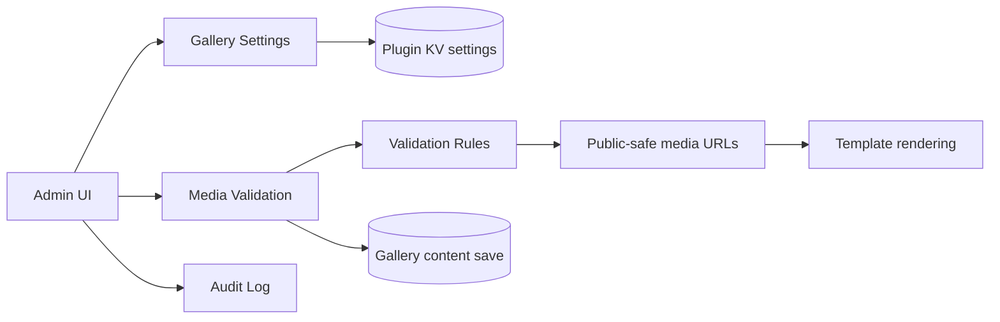
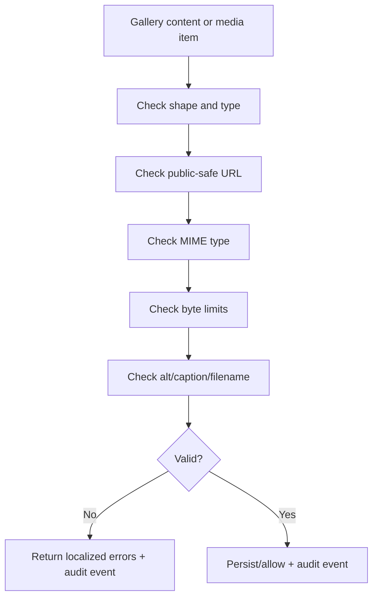

# AWCMS-Micro Gallery Technical PRD

## 1. Overview

This document describes the technical implementation requirements for `@awcms-micro/plugin-gallery`.

The plugin provides gallery settings, media validation, public listing, and audit-ready hooks. Public rendering remains template-owned and EmDash core remains untouched.

### Product Shape

- package: `@awcms-micro/plugin-gallery`
- plugin id: `awcms-micro-gallery`
- package version: current package version in `package.json`
- localization: `en` default, `id` supported
- format: standard plugin descriptor

## 2. Requirements

### Functional Requirements

- expose a gallery admin page
- persist gallery settings
- validate gallery content before save
- validate single media items on demand
- expose a public-safe list route
- write audit events for settings changes and validation results
- support Cloudflare Images and Stream as optional flags

### Non-Functional Requirements

- localized error messages in English and Indonesian
- deterministic validation results
- safe defaults for media limits
- no dependency on core media internals beyond supported EmDash APIs

### Security Requirements

- reject path traversal in filenames
- reject unsafe non-public media URLs
- reject invalid MIME types and oversized assets
- never store secrets in source or docs

## 3. Core Features

### Settings

- maximum image byte limit
- maximum video byte limit
- Cloudflare Images enabled flag
- Cloudflare Stream enabled flag

### Content Validation

- validate gallery title, type, layout, and item list
- validate each item type, source, MIME type, size, alt text, caption, and filename
- allow only public EmDash media URLs, uploads URLs, or HTTPS URLs

### Routes

- `GET /_emdash/api/plugins/awcms-micro-gallery/settings`
- `POST /_emdash/api/plugins/awcms-micro-gallery/settings`
- `GET /_emdash/api/plugins/awcms-micro-gallery/public/list`
- `POST /_emdash/api/plugins/awcms-micro-gallery/media/validate`

### Hooks

- `content:beforeSave` gallery validation hook

## 4. User Flow

### Admin Flow

1. open the gallery admin page
2. review current settings
3. adjust byte limits or Cloudflare flags
4. save settings
5. review audit feedback

### Content Author Flow

1. create or edit a gallery content item
2. add media items and metadata
3. save content
4. validate single media items when needed
5. review rejected entries and fix them before publish

### Public Flow

1. template queries the gallery public list route
2. template renders gallery cards or media lists
3. visitors consume public-safe media only

## 5. Architecture

### Implementation Files

- `src/index.ts`: plugin descriptor and route wiring
- `src/validation.ts`: content and item validation rules
- `src/i18n.ts`: localization messages
- `src/sandbox.ts`: sandbox-compatible route entry
- `src/admin.tsx` or admin page wiring where applicable

### Validation Pipeline

## 6. Database Schema

### Logical Data Model

- gallery content is stored in the `galleries` collection
- gallery items live as structured content fields inside the collection record
- plugin settings are stored in plugin-owned KV or equivalent plugin settings storage
- audit events are stored in plugin-owned audit storage, using the `gallery_audit_events` collection name

### Gallery Fields

- `title`
- `gallery_type`
- `layout_variant`
- `gallery_items`

### Stored Settings

- `maxImageBytes`
- `maxVideoBytes`
- `cloudflareImagesEnabled`
- `cloudflareStreamEnabled`

## 7. Design & Technical Constraints

### UX Constraints

- keep validation messages localized
- keep the admin surface simple and understandable
- avoid hiding invalid-state feedback

### Backend Constraints

- use deterministic validation helpers only
- audit every settings save and validation rejection/acceptance
- keep public list response safe and limited

### Media Constraints

- public media URLs only
- no path traversal in filenames
- explicit byte limit handling
- Cloudflare integrations remain optional flags until configured

### AI Constraints

- AI-assisted moderation or generation is not part of the current surface unless a separate PRD section is added
- if AI is introduced later, it must follow the product-level AI governance and data policy rules

### Testing Constraints

- test valid and invalid gallery content
- test localized validation messages
- test audit event creation
- test settings persistence and public list shape

## 8. Acceptance Criteria

- invalid gallery content is rejected with localized errors
- valid gallery content passes validation
- settings persist and reload correctly
- public list route returns safe content only
- audit events are written for changes and validation outcomes

## 9. Out Of Scope

- gallery rendering implementation inside the plugin
- template-specific layout or presentation logic
- core EmDash media pipeline changes
- unapproved external AI moderation or auto-tagging
