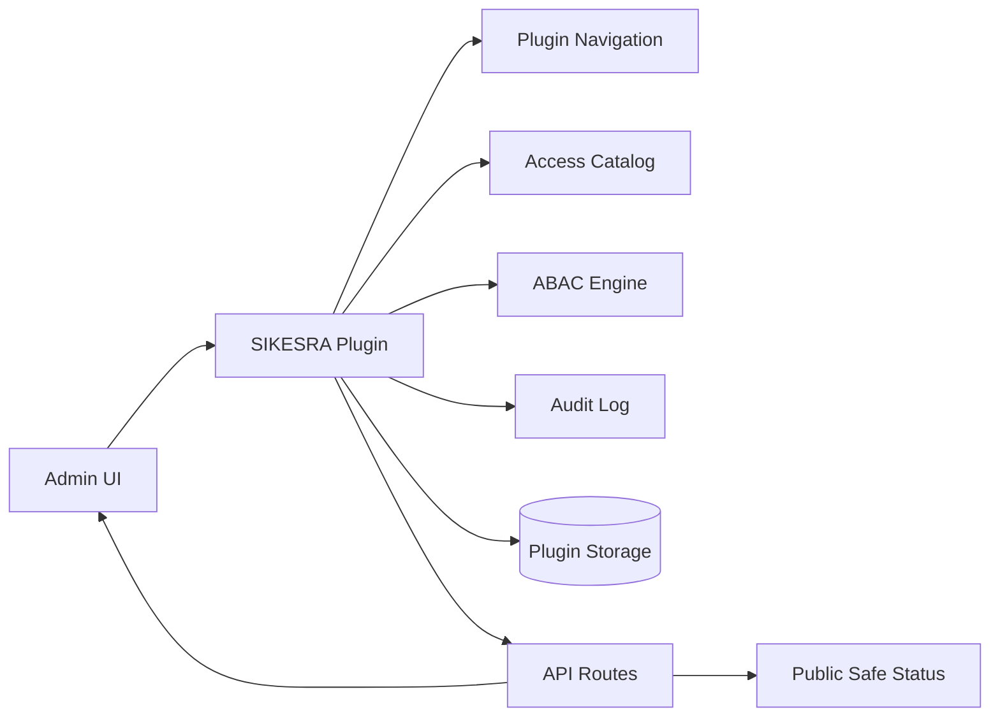
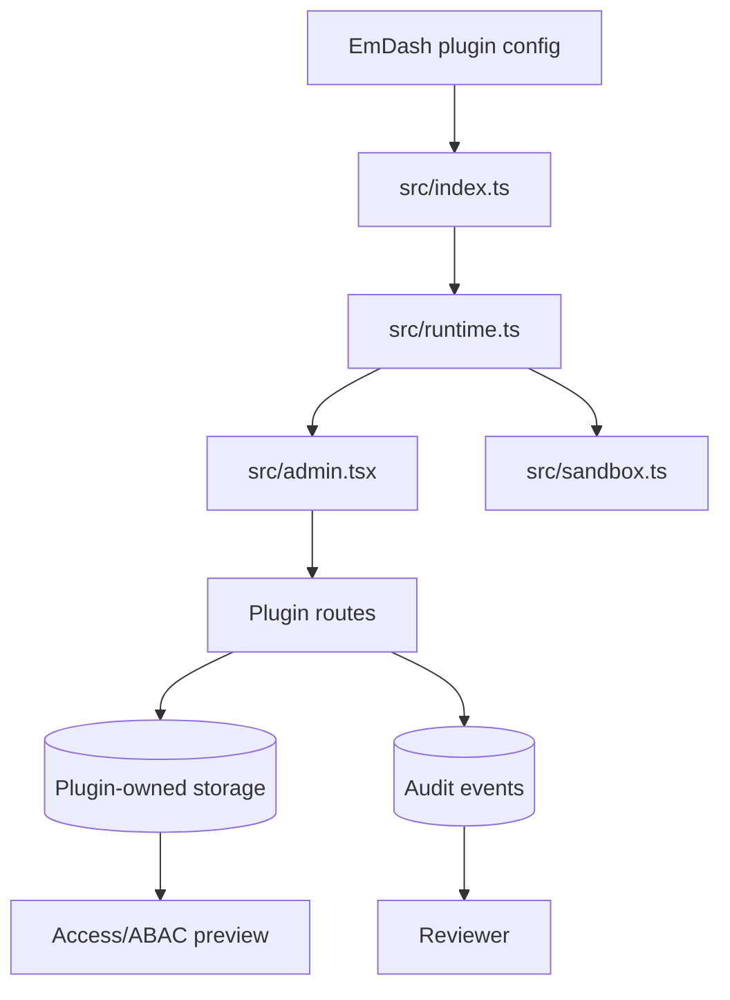
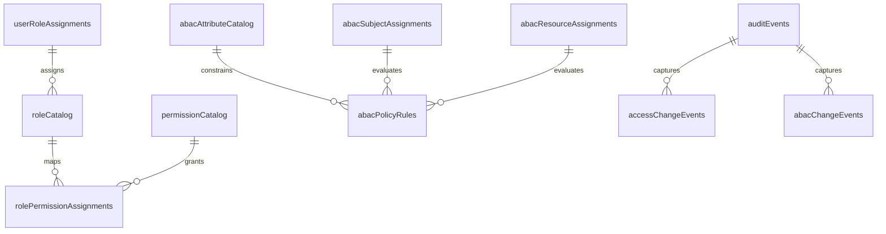

# AWCMS-Micro SIKESRA Technical PRD

> **Note (Juni 2026):** package/plugin identifiers below were corrected to match the real published package — see `docs/prd/03.PLUGIN_ARCHITECTURE.md` §8a in the repository root for the full naming history. For the complete, code-verified product/technical reference (storage model, 39 routes, security gap, etc.), see `docs/prd/` in the repository root — this file remains a useful overview of intent but `docs/prd/` is canonical.

## 1. Overview

This document describes the technical implementation requirements for `@ahliweb/awcms-sikesra`.

The plugin is an EmDash-compatible access, audit, governance, navigation, and ABAC example package. It must remain plugin-owned and must not move responsibilities into EmDash core.

### Purpose

- demonstrate a native plugin with admin UI, server routes, storage, and hooks
- provide a reusable reference for plugin-owned navigation and governance workflows
- keep security-sensitive behavior explicit, auditable, and localized

### Product Shape

- package: `@ahliweb/awcms-sikesra`
- plugin id: `awcms-sikesra`
- package version: current package version in `package.json`
- localization: `en` default, `id` supported
- UI system: Kumo components for admin surfaces

## 2. Requirements

### Functional Requirements

- expose a native plugin entry and a resolved plugin entry
- provide grouped admin navigation placed above default EmDash menus
- provide admin pages, widgets, and field widgets
- provide access-rights management, ABAC management, and audit management workflows
- provide a public-safe status route
- keep policy and preview logic inside plugin-owned routes
- support install, activate, deactivate, and uninstall lifecycle hooks
- record plugin-owned data in plugin-owned storage namespaces

### Non-Functional Requirements

- all user-facing strings must be localized
- admin layout must remain RTL-safe
- sensitive decisions must be auditable
- validation must be deterministic
- changes must remain additive unless a breaking package bump is intentional

### Security Requirements

- no global admin enforcement replacement
- no EmDash core auth fork
- no secret values in tracked source or docs
- no unchecked public route exposure beyond the explicit public-safe status endpoint

## 3. Core Features

### Navigation and Admin Modules

- dashboard summary
- registry and documents views
- verification flow
- audit log view
- access control pages
- ABAC pages
- report views

### Route Groups

- public-safe status route
- overview and summary routes
- settings routes
- audit routes
- access-rights routes
- ABAC routes
- health and preview routes

### Data and Behavior Modules

- access catalog CRUD
- role catalog CRUD
- user-to-role assignments
- role-to-permission assignments
- ABAC attribute catalog
- ABAC subject/resource assignments
- ABAC policy CRUD
- audit event capture
- content snapshot references

### Hook Surface

- lifecycle hooks
- content hooks
- media hooks
- cron hooks
- page metadata hook

## 4. User Flow

### Operator Flow

1. install the package in a workspace or standalone project
2. register the plugin through standard EmDash configuration
3. open the admin and validate that plugin navigation appears at the top
4. configure settings, roles, permissions, attributes, and policies
5. run access previews and ABAC previews
6. review audit trails and report pages
7. publish or uninstall after validation

### Reviewer Flow

1. inspect plugin boundaries and manifests
2. confirm locale support and public-safe route exposure
3. verify audit and storage behavior
4. confirm the plugin does not alter core auth behavior

## 5. Architecture

### Implementation Files

- `src/index.ts`: plugin descriptor and resolved plugin entry
- `src/admin.tsx`: native admin surface
- `src/runtime.ts`: storage, routes, hooks, and manifest definitions
- `src/navigation.ts`: navigation models and adapters
- `src/permissions.ts`: permission helpers and catalog
- `src/audit.ts`: audit recording helpers
- `src/sandbox.ts`: sandbox-compatible server-side entry

### Data Flow

### Runtime Boundaries

- native entry owns admin page and widget registration
- runtime entry owns plugin descriptor and route wiring
- sandbox entry owns server-side route compatibility
- navigation module owns plugin-local menu generation and adaptation

## 6. Database Schema

The plugin uses plugin-owned storage namespaces rather than EmDash core schema changes.

### Storage Entities

- `auditEvents`
- `accessChangeEvents`
- `abacChangeEvents`
- `abacAttributeCatalog`
- `abacPolicyRules`
- `abacResourceAssignments`
- `abacSubjectAssignments`
- `contentSnapshots`
- `permissionCatalog`
- `roleCatalog`
- `rolePermissionAssignments`
- `userRoleAssignments`

### Logical Relationships

### Schema Rules

- indexes must support timestamp, scope, and role/permission lookup
- no direct dependence on upstream core tables unless already provided by EmDash plugin APIs
- sensitive metadata must be stored only in plugin-owned storage

## 7. Design & Technical Constraints

### UI/UX Constraints

- use Kumo for admin controls
- keep labels localized
- group menu items into a distinct collapsible plugin group
- keep controls readable in light and dark themes

### Backend Constraints

- routes must be explicit and reviewable
- preview logic must not silently enforce global permissions
- audit writes must accompany sensitive changes
- public-safe routes must not leak private state

### Integration Constraints

- do not modify EmDash auth internals
- do not require template code to duplicate plugin logic
- do not introduce AI behaviors without a separate AI governance decision and approval path

### Testing Constraints

- typecheck admin and runtime code
- test navigation normalization and permissions logic
- test validation, audit writes, and public-safe route responses
- test English and Indonesian copy paths where applicable

## 8. Acceptance Criteria

- plugin registers and loads successfully in an EmDash project
- admin pages and navigation render correctly
- access preview and ABAC preview return deterministic results
- audit events are recorded for sensitive operations
- public-safe status route stays public and safe
- package changelog reflects all technical releases

## 9. Out Of Scope

- replacing EmDash core auth
- adding product-wide shared logic outside plugin boundaries
- adding template-specific presentation code here
- storing secrets in tracked files
- unreviewed AI-based enforcement or automation
