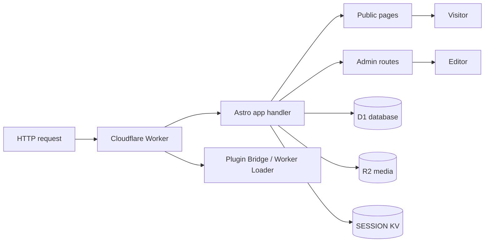
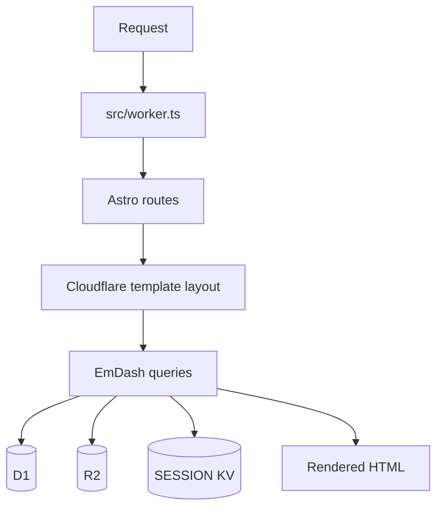

# AWCMS-Micro Default Cloudflare Template Technical PRD

## 1. Overview

This document describes the technical implementation requirements for `@awcms-micro/template-default-cloudflare`.

The template is the deployable Cloudflare-first reference surface for AWCMS-Micro. It uses Astro, EmDash, and the Cloudflare runtime while keeping core EmDash unchanged.

### Product Shape

- package: `@awcms-micro/template-default-cloudflare`
- template version: current package version in `package.json`
- runtime: Astro on Cloudflare Workers
- bindings: D1, R2, KV session storage, Worker Loader, Images binding

## 2. Requirements

### Functional Requirements

- render public pages for home, posts, news, pages, aggregate, and gallery
- support protected admin redirects and logged-in flows
- use the Cloudflare runtime entrypoint
- register `@awcms-micro/plugin-sikesra` and `@awcms-micro/plugin-gallery`
- keep binding configuration visible in `wrangler.jsonc`
- support local dev, typecheck, build, deploy, and smoke-check workflows

### Non-Functional Requirements

- repeatable deploys
- clear rollback paths
- minimal secret exposure
- stable runtime compatibility with Cloudflare Worker constraints

### Security Requirements

- keep secrets in local or CI configuration only
- keep D1, R2, and KV IDs reviewable but separate from secret values
- do not commit private credentials or tokens

## 3. Core Features

### Public Site

- homepage
- posts index and detail pages
- news index and detail pages
- content pages
- public aggregate page
- gallery page

### Cloudflare Runtime Integration

- worker entrypoint in `src/worker.ts`
- plugin bridge export from `@emdash-cms/cloudflare/sandbox`
- D1 connection for content persistence
- R2 for media storage
- session KV for auth/session state
- optional images binding and worker loader support

### Deployment Surface

- `wrangler.jsonc` is the deployment source of truth
- deployment docs describe domain, binding, and smoke-test expectations

## 4. User Flow

### Operator Flow

1. prepare bindings and placeholder configuration
2. run local typecheck and build
3. deploy with Wrangler
4. verify smoke checks
5. promote or roll back based on results

### Editor Flow

1. open the site
2. authenticate to admin
3. create or manage content in EmDash
4. verify public pages and media output on the deployed Worker

## 5. Architecture

### Implementation Files

- `src/worker.ts`: Cloudflare Worker entrypoint and plugin bridge export
- `src/pages/*.astro`: public routes and admin-facing routes
- `src/layouts/Base.astro`: shared layout and UI shell
- `src/components/*`: navigation, media, footer, language switcher, and UI helpers
- `wrangler.jsonc`: binding and deployment configuration

### Runtime Flow

### Binding Model

- `DB` for D1 content
- `MEDIA` for R2 media
- `SESSION` for session storage
- `IMAGES` for optional Cloudflare Images use
- `LOADER` for Worker Loader / plugin bridge support

## 6. Database Schema

The template does not define a new schema. It consumes EmDash content tables through D1.

### Operational Data Sources

- D1 content schema from EmDash migrations
- session state in KV
- media metadata in R2
- template vars for site URL and storage base URL

### Schema Constraints

- keep the committed D1 ID aligned with the intended deployment target
- keep migrations forward-only
- do not store secrets in the schema or docs

## 7. Design & Technical Constraints

### UI/UX Constraints

- keep the public site modern, responsive, and readable
- keep navigation and theme controls accessible
- preserve plugin-admin integration points

### Frontend Constraints

- Astro output must work in the Cloudflare runtime
- keep styles self-contained and runtime-safe
- maintain localized public copy

### Backend Constraints

- the worker entrypoint must stay minimal
- do not introduce custom edge logic that bypasses EmDash request handling
- keep admin redirects and smoke checks deterministic

### Deployment Constraints

- `wrangler.jsonc` is authoritative for the example deployment shape
- no live secrets in git
- keep D1, R2, SESSION, and domain values reviewable

### AI Constraints

- no AI behavior is enabled by default
- if AI is added later, it must follow the product PRD governance, UX, evaluation, and data policy sections

### Testing Constraints

- local typecheck must pass
- build must succeed
- deploy must resolve bindings correctly
- smoke checks must pass for public and admin routes

## 8. Acceptance Criteria

- the template deploys on Cloudflare with documented bindings
- public pages render correctly
- admin access redirects work correctly
- media and content dependencies resolve correctly
- rollback steps are documented and actionable

## 9. Out Of Scope

- upstream EmDash core changes
- non-Cloudflare deployment logic in this template
- unapproved AI automation
- secrets committed in source or docs
