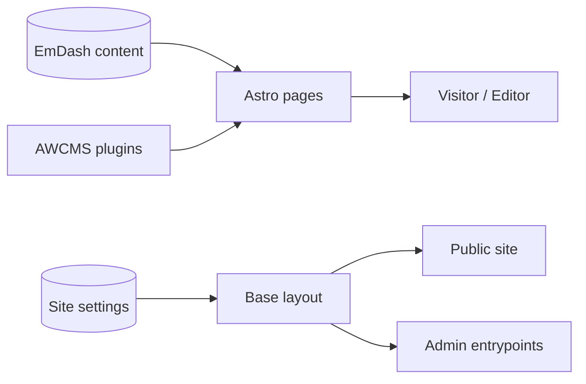
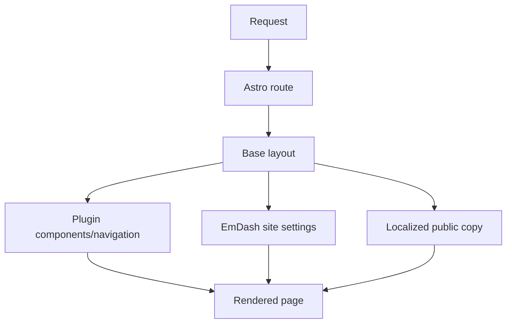

# AWCMS-Micro Default Example Template Technical PRD

## 1. Overview

This document describes the technical implementation requirements for `@awcms-micro/template-default-example`.

The template is the local Node/SQLite reference surface for AWCMS-Micro. It demonstrates public site delivery, admin linkage, localized copy, and plugin integration without modifying EmDash core.

### Product Shape

- package: `@awcms-micro/template-default-example`
- template version: current package version in `package.json`
- runtime: Astro + EmDash + Node + SQLite
- plugin dependencies: `@awcms-micro/plugin-sikesra`, `@awcms-micro/plugin-gallery`

## 2. Requirements

### Functional Requirements

- render public pages for home, posts, news, pages, aggregate, and gallery
- integrate EmDash site settings and i18n config
- expose admin entrypoints and edit shortcuts from the public homepage
- include plugin registration in the local workflow
- keep localized public copy in `en` and `id`
- support theme toggling and responsive layout

### Non-Functional Requirements

- fast local dev startup and clear build output
- production-aware template defaults
- accessible navigation and readable typography
- no direct dependency on EmDash core modifications

### Security Requirements

- no secrets in source-controlled template docs
- no hardcoded private credentials
- keep public pages safe for anonymous access

## 3. Core Features

### Public Pages

- homepage
- posts index and detail pages
- news index and detail pages
- content page routes
- public aggregate page
- gallery page and detail pages

### Template Utilities

- locale-aware path resolution
- site identity resolution
- public copy selection
- navigation and language switching

### Admin Entry Points

- login redirect to admin
- create post and page shortcuts
- navigation into plugin-owned admin surfaces

## 4. User Flow

### Visitor Flow

1. open the site homepage
2. browse posts, news, and pages
3. switch locale or theme when needed
4. open aggregate or gallery views

### Editor Flow

1. open the public site
2. jump into admin from the homepage
3. create or manage content in EmDash
4. return to the public site to verify output

### Operator Flow

1. install dependencies
2. seed content and settings
3. run the template locally
4. confirm public pages and admin redirects work

## 5. Architecture

### Implementation Files

- `src/pages/*.astro`: route entry points
- `src/layouts/BaseLayout.astro`: shared public frame
- `src/components/*`: navigation, footer, gallery, language switcher, and helper widgets
- `src/utils/*`: locale path, public copy, site identity helpers

### Rendering Flow

### Data Dependencies

- `getEmDashCollection` for posts, news, and pages
- `getSiteSettings` for site identity
- `getI18nConfig` for locale settings
- plugin-provided navigation and gallery content

## 6. Database Schema

This template does not own a custom database schema. It consumes EmDash content tables and site settings.

### Expected Data Sources

- posts collection
- news collection
- pages collection
- gallery collection when plugin is enabled
- site settings and i18n metadata

### Storage Boundary

- SQLite or compatible local database in development
- no template-owned secret storage in tracked files
- no schema forks beyond the standard EmDash model

## 7. Design & Technical Constraints

### UI/UX Constraints

- keep the homepage clear and editorially simple
- maintain accessible contrast and spacing
- keep locale switching obvious
- keep the admin entrypoints visible but not intrusive

### Frontend Constraints

- Astro-first rendering
- minimize hardcoded content and style duplication
- keep theme toggles lightweight and deterministic
- do not bind presentation directly to upstream core internals

### Backend Constraints

- rely on EmDash APIs for content queries and settings
- avoid custom backend logic in the template unless it is necessary for public presentation
- keep plugin integration through standard registration only

### AI Constraints

- the template does not introduce AI behavior by default
- any future AI-assisted UI must follow the product PRD AI governance, UX, and data policy sections

### Testing Constraints

- local typecheck must pass
- public routes must render without auth
- admin redirect must work
- locale toggle and theme toggle behavior must remain functional

## 8. Acceptance Criteria

- homepage loads and shows localized content
- public pages render from EmDash collections
- admin login shortcut works
- plugin registration is reflected in the local workflow
- layout remains responsive and accessible

## 9. Out Of Scope

- Cloudflare-specific deployment wiring
- custom database schema ownership
- core EmDash changes
- AI automation embedded in the template
