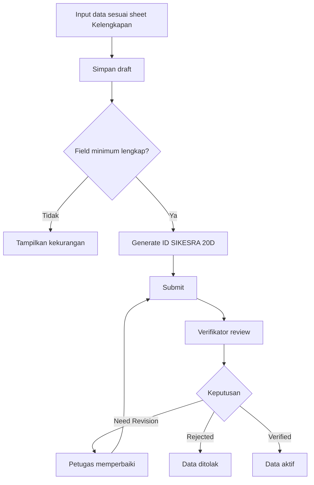

# PRD MVP SIKESRA Berbasis AWCMS Mini Single-Tenant dan Sheet Kelengkapan Excel

Versi: 0.4 MVP Teknis
Status: Draft teknis yang disinkronkan dengan baseline repository `ahliweb/sikesra`
Sumber utama field: Sheet “Kelengkapan” pada file Excel “Data Kelengkapan Pendukung Sikesra”
Platform utama: AWCMS Mini single-tenant
Prioritas: MVP minimal, kodefikasi ID SIKESRA 20 digit, PostgreSQL, Kysely, RBAC/ABAC, audit log, dokumen R2, form sesuai Excel, dan baseline runtime Cloudflare Worker + Coolify PostgreSQL

---

## 1. Ringkasan Eksekutif

Dokumen ini menggantikan penyesuaian teknis pada PRD sebelumnya agar SIKESRA MVP dibangun menggunakan AWCMS Mini single-tenant, bukan AWCMS multi-tenant penuh dan bukan Supabase-first.

Sumber kebenaran field input adalah sheet “Kelengkapan” dalam Excel. Apabila terdapat perbedaan antara PDF, asumsi sebelumnya, dan Excel, maka prioritas keputusan adalah:

1. AWCMS Mini single-tenant sebagai platform teknis utama.
2. Sheet “Kelengkapan” Excel sebagai sumber field input utama.
3. PDF hanya dipakai sebagai pelengkap konsep bila tidak bertentangan.
4. PostgreSQL sebagai database utama.
5. Kysely sebagai query builder/typed SQL layer.
6. Cloudflare Worker dan R2 sebagai baseline hosting dan object storage yang ditinjau.
7. ID SIKESRA 20 digit tetap digunakan sebagai business identifier resmi.
8. UUID tetap digunakan sebagai primary key internal.

MVP ini ditujukan untuk mengubah workbook Excel menjadi aplikasi database single-tenant yang aman, rapi, dapat diaudit, dapat diverifikasi, dan dapat dikembangkan bertahap.

### 1.1 Catatan Sinkronisasi Repository Saat Ini

Dokumen ini diselaraskan dengan baseline repository `ahliweb/sikesra` saat ini:

1. Repository implementasi writable adalah `ahliweb/sikesra`; `ahliweb/awcms-mini` hanya referensi read-only.
2. Runtime produksi yang ditinjau adalah Cloudflare Worker, bukan Cloudflare Pages.
3. Host browser publik yang ditinjau adalah `https://sikesrakobar.ahlikoding.com` dengan alias admin `/_emdash/` pada host yang sama.
4. Dokumen/media menggunakan bucket R2 `sikesra` melalui binding Worker `MEDIA_BUCKET`.
5. PostgreSQL produksi berada pada VPS yang dikelola melalui Coolify, dengan transport Worker yang ditinjau melalui binding Hyperdrive `HYPERDRIVE`.
6. Terminologi modul umum menggunakan `Guru Agama`, bukan `Guru Ngaji`.
7. Baseline UI/UX repository saat ini juga mencakup follow-on scope `Agama` sebagai reference field terkontrol dan modul `Lansia Terlantar`; keduanya harus diperlakukan sebagai bagian dari arah MVP yang sedang diimplementasikan, meskipun sebagian backend persistence masih menjadi follow-on.
8. Status repository saat ini bukan lagi planning murni: model-layer admin/plugin untuk UI/UX telah diimplementasikan, sementara blocker tersisa adalah integrasi live host build dan backend master data agama.

---

## 2. Keputusan Platform Teknis

### 2.1 Platform yang Digunakan

SIKESRA MVP menggunakan AWCMS Mini single-tenant dengan karakter utama:

1. Single-tenant governance overlay.
2. Astro sebagai basis aplikasi web.
3. PostgreSQL sebagai database utama.
4. Kysely sebagai typed SQL/query builder.
5. EmDash CMS integration sebagai host/content architecture bila dipakai.
6. RBAC dan ABAC untuk otorisasi.
7. Protected roles dan staff-level rules.
8. Administrative region governance untuk pembatasan wilayah operasional.
9. TOTP-based 2FA, recovery, lockout, dan step-up authentication bila diaktifkan.
10. Audit logs dan security events.
11. Internal plugin contracts untuk modul SIKESRA.
12. Cloudflare Worker runtime sebagai baseline deployment edge.
13. Cloudflare R2 untuk file/dokumen melalui binding `MEDIA_BUCKET`.

### 2.2 Yang Tidak Digunakan pada MVP Ini

Karena menggunakan AWCMS Mini single-tenant, MVP ini tidak memprioritaskan:

1. Supabase Auth sebagai fondasi utama.
2. Supabase RLS sebagai kontrol utama.
3. Multi-tenant kompleks lintas kabupaten.
4. AWCMS monorepo multi-channel penuh.
5. AWCMS Public terpisah berbasis tenant multi-instance.
6. AWCMS Mobile Flutter pada MVP pertama.
7. Sinkronisasi DTSEN.
8. API publik sensitif.

Catatan: kontrol akses tetap wajib kuat, tetapi ditegakkan melalui model AWCMS Mini: session/auth internal, service-layer authorization, RBAC/ABAC, administrative region scope, middleware/route guards, database constraints, audit logs, dan explicit policy checks di service layer.

### 2.3 Rekomendasi Deployment MVP

Opsi sederhana:

1. AWCMS Mini berjalan sebagai aplikasi Astro.
2. PostgreSQL di VPS yang dikelola melalui Coolify.
3. File dokumen disimpan di Cloudflare R2 private bucket.
4. Cloudflare DNS/CDN/WAF/Turnstile digunakan untuk proteksi publik.
5. Backup database harian dan backup object metadata.

Opsi produksi awal yang direkomendasikan:

1. Frontend dan runtime AWCMS Mini: Cloudflare Worker runtime.
2. PostgreSQL: VPS PostgreSQL yang dikelola melalui Coolify dengan koneksi aman.
3. File: Cloudflare R2 private bucket dengan binding `MEDIA_BUCKET`.
4. Secrets: env lokal ter-ignored untuk operator lokal, Cloudflare Worker secrets untuk runtime Worker, dan Coolify locked runtime secrets untuk resource/aplikasi yang dikelola di Coolify; bukan hardcoded.
5. Security: Turnstile untuk login/reset/invite bila tersedia, 2FA untuk admin penting, dan transport database produksi melalui Hyperdrive `HYPERDRIVE`.

---

## 3. Prinsip Implementasi SIKESRA pada AWCMS Mini

1. Single-tenant first: satu instalasi untuk satu kabupaten/instansi.
2. Database-first: struktur PostgreSQL menjadi sumber kebenaran data.
3. Field Excel-first: form input wajib mengikuti sheet “Kelengkapan”.
4. Secure-by-default: semua data internal, kecuali jelas aman untuk publik.
5. RBAC/ABAC from day one: role, permission, wilayah, status, dan klasifikasi data dikontrol sejak awal.
6. Audit-friendly: semua aksi penting tercatat.
7. Soft delete: data bisnis tidak dihapus permanen melalui UI biasa.
8. Code-first governance: kodefikasi ID SIKESRA 20 digit menjadi identitas bisnis resmi.
9. Region-aware: wilayah resmi sampai desa/kelurahan, micro region sebagai atribut tambahan.
10. Expandable: modul bisa bertambah tanpa merombak fondasi.

---

## 4. Modul MVP Berdasarkan Sheet Kelengkapan

MVP minimal wajib menyediakan modul berikut:

1. Rumah Ibadah
2. Lembaga Keagamaan
3. Lembaga Pendidikan Keagamaan
4. Lembaga Kesejahteraan Sosial
5. Guru Agama
6. Anak Yatim
7. Disabilitas
8. Dokumen Pendukung
9. Wilayah Resmi
10. Wilayah Custom/Micro Region
11. Verifikasi Data
12. Audit Log
13. User, Role, Permission
14. Import Excel
15. Export Laporan

Modul Rukun Kematian dan Panti Asuhan tetap dapat tampil sebagai menu khusus, tetapi secara data MVP dapat dikelola sebagai subjenis dari Lembaga Kesejahteraan Sosial sesuai sheet Kelengkapan.

---

## 5. Kodefikasi ID SIKESRA 20 Digit

### 5.1 Format ID

Format:

[kode_desa_kel_10][jenis_2][subjenis_2][id_objek_6]

Contoh:

62010210050101000001

Struktur:

1. 6201021005 = kode desa/kelurahan resmi 10 digit.
2. 01 = jenis data.
3. 01 = subjenis data.
4. 000001 = nomor urut objek.

### 5.2 Prinsip ID

1. UUID tetap primary key internal.
2. sikesra_id_20 menjadi business identifier resmi.
3. ID dibuat otomatis saat data siap diajukan atau minimal valid.
4. ID tidak berubah meskipun nama, pengurus, dokumen, atau micro region berubah.
5. ID tidak boleh diedit oleh operator biasa.
6. Koreksi ID hanya untuk admin khusus dengan audit ketat.
7. Micro region tidak masuk ID.

### 5.3 Master Jenis dan Subjenis Sesuai Excel

Kode jenis/subjenis MVP disesuaikan dengan sheet Kelengkapan:

| Jenis | Kode | Subjenis Awal |
|---|---:|---|
| Rumah Ibadah | 01 | 01 Masjid, 02 Musholla, 03 Surau, 04 Gereja, 05 Pura, 06 Wihara, 07 Klenteng |
| Lembaga Keagamaan | 02 | 01 Islam, 02 Kristen, 03 Katholik, 04 Hindu, 05 Budha, 06 Konghuchu |
| Lembaga Pendidikan Keagamaan | 03 | 01 TPA/TPQ, 02 Pondok Pesantren, 03 Lainnya |
| Lembaga Kesejahteraan Sosial | 04 | 01 Baznas, 02 PWRI, 03 Panti Asuhan, 04 Panti Yatim, 05 Panti Jompo, 06 Rukun Kematian, 07 Majelis Taklim |
| Guru Agama | 05 | 01 Rumahan, 02 Lembaga |
| Anak Yatim | 06 | 01 Anak Yatim, 02 Anak Piatu, 03 Anak Yatim Piatu |
| Disabilitas | 07 | 01 Fisik, 02 Intelektual, 03 Mental, 04 Sensorik |

Catatan: jika jenis/subjenis tambahan dibutuhkan, sistem harus mendukung tambah master data melalui admin dengan permission khusus.

---

## 6. Rancangan Database AWCMS Mini

### 6.1 Prinsip Database

1. Tidak menggunakan tenant_id wajib karena single-tenant.
2. Bila ingin future-proof, boleh memakai app_scope atau site_id opsional, tetapi tidak menjadi syarat utama MVP.
3. Semua tabel bisnis memakai UUID primary key.
4. Semua entitas utama memiliki sikesra_id_20 nullable sampai kode dibuat.
5. Semua entitas utama memiliki status data, status verifikasi, created_by, updated_by, deleted_at.
6. Data sensitif diberi klasifikasi akses dan/atau enkripsi/hash.
7. Semua operasi penting dicatat di audit_logs.

### 6.2 Tabel Inti

1. users
2. roles
3. permissions
4. user_roles
5. role_permissions
6. user_region_scopes
7. wilayah_resmi
8. wilayah_custom
9. sikesra_object_types
10. sikesra_object_subtypes
11. sikesra_code_sequences
12. sikesra_entities
13. rumah_ibadah_details
14. lembaga_keagamaan_details
15. lembaga_pendidikan_keagamaan_details
16. lembaga_kesejahteraan_sosial_details
17. guru_agama_details
18. anak_yatim_details
19. disabilitas_details
20. entity_people
21. dokumen_pendukung
22. file_objects
23. verification_events
24. audit_logs
25. import_batches
26. import_staging_rows

### 6.3 Tabel sikesra_entities

Registry inti seluruh data SIKESRA.

| Field | Tipe | Wajib | Keterangan |
|---|---|---:|---|
| id | uuid | Ya | Primary key internal |
| sikesra_id_20 | char(20) | Tidak | ID resmi setelah generate |
| object_type_code | char(2) | Ya | Kode jenis data |
| object_subtype_code | char(2) | Ya | Kode subjenis data |
| entity_kind | varchar | Ya | institution/person |
| display_name | varchar | Ya | Nama utama objek |
| official_village_code | char(10) | Ya | Kode desa/kelurahan resmi |
| wilayah_custom_id | uuid | Tidak | Dusun/RW/RT/zona bila ada |
| address_text | text | Ya | Alamat sesuai Excel |
| phone | varchar | Tidak | Nomor kontak utama |
| email | varchar | Tidak | Email utama |
| latitude | numeric | Tidak | Koordinat |
| longitude | numeric | Tidak | Koordinat |
| status_data | varchar | Ya | draft/submitted/active/archived |
| status_verifikasi | varchar | Ya | pending/verified/rejected/need_revision |
| visibility_level | varchar | Ya | internal/restricted/highly_restricted/public_safe |
| source_input | varchar | Ya | manual/excel_import/field_survey |
| created_by | uuid | Ya | User pembuat |
| updated_by | uuid | Tidak | User pengubah |
| verified_by | uuid | Tidak | User verifikator terakhir |
| created_at | timestamptz | Ya | Timestamp |
| updated_at | timestamptz | Ya | Timestamp |
| verified_at | timestamptz | Tidak | Timestamp verifikasi |
| deleted_at | timestamptz | Tidak | Soft delete |
| catatan | text | Tidak | Catatan umum |

---

## 7. Rincian Field Input per Modul Sesuai Sheet Kelengkapan

## 7.1 Modul Rumah Ibadah

### Kategori/Subjenis

Pilihan jenis rumah ibadah:

1. Masjid
2. Musholla
3. Surau
4. Gereja
5. Pura
6. Wihara
7. Klenteng

### Field Form Utama

| No | Field di Form | Tipe Input | Wajib | Tabel/Field Target | Catatan |
|---:|---|---|---:|---|---|
| 1 | Jenis Rumah Ibadah | Select | Ya | sikesra_entities.object_subtype_code | Pilihan kategori di atas |
| 2 | Nama Rumah Ibadah | Text | Ya | sikesra_entities.display_name | Sumber Excel nomor 1 |
| 3 | Alamat | Textarea | Ya | sikesra_entities.address_text | Format: Jl., RT, RW |
| 4 | Desa/Kelurahan | Cascade select | Ya | sikesra_entities.official_village_code | Wilayah resmi |
| 5 | Kecamatan | Auto/cascade | Ya | wilayah_resmi | Turunan wilayah |
| 6 | Wilayah Custom/Dusun/RW/RT | Select/input | Tidak | sikesra_entities.wilayah_custom_id | Tidak masuk ID 20D |
| 7 | Upload SK Kepengurusan | File upload | Tidak/MVP disarankan | dokumen_pendukung | Jenis dokumen SK_KEPENGURUSAN |
| 8 | Ketua - Nama | Text | Tidak | entity_people.person_name | role_in_entity = ketua |
| 9 | Ketua - NIK | Text sensitif | Tidak | entity_people.nik_encrypted/nik_hash | Restricted |
| 10 | Sekretaris - Nama | Text | Tidak | entity_people | role_in_entity = sekretaris |
| 11 | Sekretaris - NIK | Text sensitif | Tidak | entity_people | Restricted |
| 12 | Bendahara - Nama | Text | Tidak | entity_people | role_in_entity = bendahara |
| 13 | Bendahara - NIK | Text sensitif | Tidak | entity_people | Restricted |
| 14 | Pernah Menerima Hibah | Boolean/select | Tidak | rumah_ibadah_details.pernah_menerima_hibah | Ya/Tidak |
| 15 | Hibah Provinsi - Tahun | Number/year | Tidak | rumah_ibadah_details.hibah_provinsi_tahun | Jika pernah hibah |
| 16 | Hibah Provinsi - Nominal | Currency | Tidak | rumah_ibadah_details.hibah_provinsi_nominal | Jika pernah hibah |
| 17 | Hibah Kabupaten - Tahun | Number/year | Tidak | rumah_ibadah_details.hibah_kabupaten_tahun | Jika pernah hibah |
| 18 | Hibah Kabupaten - Nominal | Currency | Tidak | rumah_ibadah_details.hibah_kabupaten_nominal | Jika pernah hibah |
| 19 | Imam Tetap - Nama | Repeatable text | Tidak | entity_people | role_in_entity = imam_tetap, bisa lebih dari satu |
| 20 | Imam Tetap - NIK | Repeatable sensitive text | Tidak | entity_people | Restricted |
| 21 | Bilal - Nama | Repeatable text | Tidak | entity_people | role_in_entity = bilal, bisa lebih dari satu |
| 22 | Bilal - NIK | Repeatable sensitive text | Tidak | entity_people | Restricted |
| 23 | Marbot - Nama | Repeatable text | Tidak | entity_people | role_in_entity = marbot, bisa lebih dari satu |
| 24 | Marbot - NIK | Repeatable sensitive text | Tidak | entity_people | Restricted |
| 25 | ID Masjid | Text | Tidak | rumah_ibadah_details.id_masjid | Khusus masjid jika ada |
| 26 | Dokumen ID Masjid | File upload | Tidak | dokumen_pendukung | Jenis dokumen ID_MASJID |
| 27 | Foto Bangunan | File upload | Tidak/MVP disarankan | dokumen_pendukung | Jenis dokumen FOTO_BANGUNAN |
| 28 | Telepon/WA Pengurus Ketua | Text/phone | Tidak | sikesra_entities.phone | Dapat juga disimpan pada ketua |
| 29 | Email Lembaga/Pengurus | Email | Tidak | sikesra_entities.email | Validasi format email |

### Tabel Detail: rumah_ibadah_details

| Field | Tipe | Keterangan |
|---|---|---|
| id | uuid | Primary key |
| entity_id | uuid | FK ke sikesra_entities |
| jenis_rumah_ibadah | varchar | Masjid/Musholla/Surau/dll |
| pernah_menerima_hibah | boolean | Ya/Tidak |
| hibah_provinsi_tahun | int | Tahun hibah provinsi |
| hibah_provinsi_nominal | numeric | Nominal hibah provinsi |
| hibah_kabupaten_tahun | int | Tahun hibah kabupaten |
| hibah_kabupaten_nominal | numeric | Nominal hibah kabupaten |
| id_masjid | varchar | ID masjid bila ada |
| created_at | timestamptz | Timestamp |
| updated_at | timestamptz | Timestamp |

---

## 7.2 Modul Lembaga Keagamaan

### Kategori Agama

1. Islam
2. Kristen
3. Katholik
4. Hindu
5. Budha
6. Konghuchu

### Pilihan Nama Lembaga Islam Awal dari Excel

1. Majelis Ulama Indonesia
2. Nahdlatul Ulama
3. Muhammadiyah
4. Lembaga Pengembangan Tilawatil Qur'an (LPTQ)
5. Lembaga Seni Qasidah Indonesia (LASQI)
6. Lembaga Dakwah Islam Indonesia (LDII)
7. Panitia Hari-hari Besar Islam (PHBI)
8. Lainnya bisa buat baru

### Field Form Utama

| No | Field di Form | Tipe Input | Wajib | Tabel/Field Target | Catatan |
|---:|---|---|---:|---|---|
| 1 | Agama | Select | Ya | lembaga_keagamaan_details.agama | Pilihan agama |
| 2 | Nama Lembaga | Select/text | Ya | sikesra_entities.display_name | Bisa pilih master atau buat baru |
| 3 | Alamat | Textarea | Ya | sikesra_entities.address_text | Format Excel |
| 4 | Desa/Kelurahan | Cascade select | Ya | sikesra_entities.official_village_code | Wilayah resmi |
| 5 | Wilayah Custom/Dusun/RW/RT | Select/input | Tidak | sikesra_entities.wilayah_custom_id | Tidak masuk ID |
| 6 | Bidang Kegiatan | Textarea | Tidak | lembaga_keagamaan_details.bidang_kegiatan | Dari Excel |
| 7 | SK Pendirian | File upload | Tidak/MVP disarankan | dokumen_pendukung | Jenis SK_PENDIRIAN |
| 8 | SK Kepengurusan | File upload | Tidak/MVP disarankan | dokumen_pendukung | Jenis SK_KEPENGURUSAN |
| 9 | Ketua - Nama | Text | Tidak | entity_people | role ketua |
| 10 | Ketua - NIK | Text sensitif | Tidak | entity_people | Restricted |
| 11 | Sekretaris - Nama | Text | Tidak | entity_people | role sekretaris |
| 12 | Sekretaris - NIK | Text sensitif | Tidak | entity_people | Restricted |
| 13 | Bendahara - Nama | Text | Tidak | entity_people | role bendahara |
| 14 | Bendahara - NIK | Text sensitif | Tidak | entity_people | Restricted |
| 15 | Dokumentasi Kegiatan | File upload | Tidak | dokumen_pendukung | Excel menyebut upload |
| 16 | Telepon/WA Pengurus Ketua | Text/phone | Tidak | sikesra_entities.phone | Validasi format |
| 17 | Email Lembaga/Pengurus | Email | Tidak | sikesra_entities.email | Validasi format |

### Tabel Detail: lembaga_keagamaan_details

| Field | Tipe | Keterangan |
|---|---|---|
| id | uuid | Primary key |
| entity_id | uuid | FK |
| agama | varchar | Islam/Kristen/Katholik/Hindu/Budha/Konghuchu |
| nama_lembaga_master | varchar | Bila dari pilihan master |
| bidang_kegiatan | text | Bidang kegiatan |
| created_at | timestamptz | Timestamp |
| updated_at | timestamptz | Timestamp |

---

## 7.3 Modul Lembaga Pendidikan Keagamaan

### Kategori

1. TPA/TPQ
2. Pondok Pesantren
3. Lainnya bila dibuat kemudian

### Field Form Utama

| No | Field di Form | Tipe Input | Wajib | Tabel/Field Target | Catatan |
|---:|---|---|---:|---|---|
| 1 | Jenis Lembaga Pendidikan | Select | Ya | sikesra_entities.object_subtype_code | TPA/TPQ/Pondok Pesantren |
| 2 | Nama Lembaga | Text | Ya | sikesra_entities.display_name | Dari Excel nomor 1 |
| 3 | Alamat | Textarea | Ya | sikesra_entities.address_text | Format Excel |
| 4 | Desa/Kelurahan | Cascade select | Ya | sikesra_entities.official_village_code | Wilayah resmi |
| 5 | Wilayah Custom/Dusun/RW/RT | Select/input | Tidak | sikesra_entities.wilayah_custom_id | Tidak masuk ID |
| 6 | Badan Hukum | File upload | Tidak/MVP disarankan | dokumen_pendukung | Jenis BADAN_HUKUM |
| 7 | Bidang Kegiatan | Textarea | Tidak | lembaga_pendidikan_keagamaan_details.bidang_kegiatan | Dari Excel |
| 8 | SK Kepengurusan | File upload | Tidak | dokumen_pendukung | Jenis SK_KEPENGURUSAN |
| 9 | Ketua - Nama | Text | Tidak | entity_people | role ketua |
| 10 | Ketua - NIK | Text sensitif | Tidak | entity_people | Restricted |
| 11 | Sekretaris - Nama | Text | Tidak | entity_people | role sekretaris |
| 12 | Sekretaris - NIK | Text sensitif | Tidak | entity_people | Restricted |
| 13 | Bendahara - Nama | Text | Tidak | entity_people | role bendahara |
| 14 | Bendahara - NIK | Text sensitif | Tidak | entity_people | Restricted |
| 15 | Jumlah Pengajar | Number | Tidak | lembaga_pendidikan_keagamaan_details.jumlah_pengajar | Dari Excel |
| 16 | Jumlah Santri | Number | Tidak | lembaga_pendidikan_keagamaan_details.jumlah_santri | Dari Excel |
| 17 | Dokumentasi Kegiatan | File upload/text | Tidak | dokumen_pendukung | Di Excel tertulis ketik, tapi konteks dokumentasi lebih aman sebagai upload + catatan |
| 18 | Telepon/WA Pengurus Ketua | Text/phone | Tidak | sikesra_entities.phone | Validasi format |
| 19 | Email Lembaga/Pengurus | Email | Tidak | sikesra_entities.email | Validasi format |

### Tabel Detail: lembaga_pendidikan_keagamaan_details

| Field | Tipe | Keterangan |
|---|---|---|
| id | uuid | Primary key |
| entity_id | uuid | FK |
| jenis_pendidikan | varchar | TPA/TPQ/Pondok Pesantren |
| bidang_kegiatan | text | Bidang kegiatan |
| jumlah_pengajar | int | Jumlah pengajar |
| jumlah_santri | int | Jumlah santri |
| dokumentasi_kegiatan_note | text | Catatan dokumentasi jika berupa teks |
| created_at | timestamptz | Timestamp |
| updated_at | timestamptz | Timestamp |

---

## 7.4 Modul Lembaga Kesejahteraan Sosial

### Kategori

1. Baznas
2. PWRI
3. Panti Asuhan
4. Panti Yatim
5. Panti Jompo
6. Rukun Kematian
7. Majelis Taklim

### Field Form Utama

| No | Field di Form | Tipe Input | Wajib | Tabel/Field Target | Catatan |
|---:|---|---|---:|---|---|
| 1 | Jenis Lembaga Kesejahteraan Sosial | Select | Ya | sikesra_entities.object_subtype_code | Pilihan kategori |
| 2 | Nama Lembaga | Text | Ya | sikesra_entities.display_name | Dari Excel nomor 1 |
| 3 | Alamat | Textarea | Ya | sikesra_entities.address_text | Format Excel |
| 4 | Desa/Kelurahan | Cascade select | Ya | sikesra_entities.official_village_code | Wilayah resmi |
| 5 | Wilayah Custom/Dusun/RW/RT | Select/input | Tidak | sikesra_entities.wilayah_custom_id | Tidak masuk ID |
| 6 | Badan Hukum | File upload | Tidak/MVP disarankan | dokumen_pendukung | Jenis BADAN_HUKUM |
| 7 | Bidang Kegiatan | Textarea | Tidak | lembaga_kesejahteraan_sosial_details.bidang_kegiatan | Dari Excel |
| 8 | SK Kepengurusan | File upload | Tidak | dokumen_pendukung | Jenis SK_KEPENGURUSAN |
| 9 | Ketua - Nama | Text | Tidak | entity_people | role ketua |
| 10 | Ketua - NIK | Text sensitif | Tidak | entity_people | Restricted |
| 11 | Sekretaris - Nama | Text | Tidak | entity_people | role sekretaris |
| 12 | Sekretaris - NIK | Text sensitif | Tidak | entity_people | Restricted |
| 13 | Bendahara - Nama | Text | Tidak | entity_people | role bendahara |
| 14 | Bendahara - NIK | Text sensitif | Tidak | entity_people | Restricted |
| 15 | Jumlah Pengasuh | Number | Tidak | lembaga_kesejahteraan_sosial_details.jumlah_pengasuh | Dari Excel |
| 16 | Jumlah Anak Asuh | Number | Tidak | lembaga_kesejahteraan_sosial_details.jumlah_anak_asuh | Dari Excel |
| 17 | Dokumentasi Kegiatan | File upload/text | Tidak | dokumen_pendukung | Excel tertulis ketik; sistem boleh siapkan catatan + upload |
| 18 | Telepon/WA Pengurus Ketua | Text/phone | Tidak | sikesra_entities.phone | Validasi format |
| 19 | Email Lembaga/Pengurus | Email | Tidak | sikesra_entities.email | Validasi format |

### Tabel Detail: lembaga_kesejahteraan_sosial_details

| Field | Tipe | Keterangan |
|---|---|---|
| id | uuid | Primary key |
| entity_id | uuid | FK |
| jenis_lks | varchar | Baznas/PWRI/Panti/Rukun Kematian/dll |
| bidang_kegiatan | text | Bidang kegiatan |
| jumlah_pengasuh | int | Jumlah pengasuh |
| jumlah_anak_asuh | int | Jumlah anak asuh |
| dokumentasi_kegiatan_note | text | Catatan dokumentasi jika teks |
| created_at | timestamptz | Timestamp |
| updated_at | timestamptz | Timestamp |

---

## 7.5 Modul Guru Agama

### Kategori Status Guru Agama

1. Rumahan
2. Lembaga

### Field Form Utama

| No | Field di Form | Tipe Input | Wajib | Tabel/Field Target | Catatan |
|---:|---|---|---:|---|---|
| 1 | Nama Lengkap | Text | Ya | sikesra_entities.display_name | Dari Excel |
| 2 | NIK | Text sensitif | Tidak/MVP disarankan wajib bila pendataan resmi | guru_agama_details.nik_encrypted/nik_hash | Highly restricted |
| 3 | TTL | Text/date split | Tidak | guru_agama_details.tempat_lahir + tanggal_lahir | Excel menyebut ketik; sistem sebaiknya pisah tempat dan tanggal |
| 4 | Alamat Rumah | Textarea | Ya | sikesra_entities.address_text | Format Excel |
| 5 | Desa/Kelurahan | Cascade select | Ya | sikesra_entities.official_village_code | Wilayah resmi |
| 6 | Wilayah Custom/Dusun/RW/RT | Select/input | Tidak | sikesra_entities.wilayah_custom_id | Tidak masuk ID |
| 7 | Status Guru Agama | Select | Ya | guru_agama_details.status_guru_agama | Rumahan/Lembaga |
| 8 | Nama TKA/TPA | Text | Tidak | guru_agama_details.nama_tka_tpa | Bila status lembaga |
| 9 | Alamat TKA/TPA | Textarea | Tidak | guru_agama_details.alamat_tka_tpa | Bila status lembaga |
| 10 | Telepon/WA Pengurus Ketua | Text/phone | Tidak | sikesra_entities.phone | Sesuai Excel, bisa dimaknai kontak lembaga/pengurus |
| 11 | Email Lembaga/Pengurus | Email | Tidak | sikesra_entities.email | Sesuai Excel |

### Tabel Detail: guru_agama_details

| Field | Tipe | Keterangan |
|---|---|---|
| id | uuid | Primary key |
| entity_id | uuid | FK |
| nik_encrypted | text | NIK terenkripsi |
| nik_hash | text | Hash untuk deduplikasi |
| tempat_lahir | varchar | Tempat lahir bila dipisah |
| tanggal_lahir | date | Tanggal lahir bila tersedia |
| ttl_raw | varchar | Simpan raw TTL dari Excel/import |
| status_guru_agama | varchar | Rumahan/Lembaga |
| nama_tka_tpa | varchar | Nama lembaga mengajar |
| alamat_tka_tpa | text | Alamat lembaga mengajar |
| created_at | timestamptz | Timestamp |
| updated_at | timestamptz | Timestamp |

---

## 7.6 Modul Anak Yatim

### Kategori MVP

1. Anak Yatim
2. Anak Piatu
3. Anak Yatim Piatu

Catatan: Excel menulis “Anak Yatim”, tetapi untuk implementasi kodefikasi dan rekap, sistem perlu menyediakan subkategori yatim/piatu/yatim-piatu agar fleksibel. Jika belum ada field eksplisit di Excel, default kategori dapat “Anak Yatim” dan dapat diedit oleh admin.

### Field Form Utama

| No | Field di Form | Tipe Input | Wajib | Tabel/Field Target | Catatan |
|---:|---|---|---:|---|---|
| 1 | Kategori Anak | Select | Ya | sikesra_entities.object_subtype_code | Default Anak Yatim bila impor Excel |
| 2 | Nama Lengkap | Text | Ya | sikesra_entities.display_name | Dari Excel |
| 3 | NIK/KIA | Text sensitif | Tidak/MVP disarankan | anak_yatim_details.nik_kia_encrypted/nik_kia_hash | Highly restricted |
| 4 | TTL | Date/text split | Tidak | anak_yatim_details.tempat_lahir + tanggal_lahir | Excel: klik dd/m/y |
| 5 | Jenis Kelamin | Select | Ya | anak_yatim_details.jenis_kelamin | L/P |
| 6 | Alamat | Textarea | Ya | sikesra_entities.address_text | Format Excel |
| 7 | Desa/Kelurahan | Cascade select | Ya | sikesra_entities.official_village_code | Wilayah resmi |
| 8 | Wilayah Custom/Dusun/RW/RT | Select/input | Tidak | sikesra_entities.wilayah_custom_id | Tidak masuk ID |
| 9 | Jenjang Sekolah | Select | Tidak | anak_yatim_details.jenjang_sekolah | TK/SD/SMP/SMA |
| 10 | Nama Sekolah | Text | Tidak | anak_yatim_details.nama_sekolah | Dari Excel |
| 11 | Nama Wali/Pengasuh | Text | Ya/Disarankan | entity_people.person_name | role wali/pengasuh |
| 12 | NIK Wali/Pengasuh | Text sensitif | Tidak | entity_people.nik_encrypted/nik_hash | Highly restricted |
| 13 | Hubungan Keluarga | Text | Tidak | anak_yatim_details.hubungan_wali | Dari Excel |
| 14 | Upload KK | File upload | Tidak/MVP disarankan | dokumen_pendukung | Jenis KARTU_KELUARGA |
| 15 | Telepon/WA Wali | Text/phone | Tidak | entity_people.phone atau sikesra_entities.phone | Kontak wali |
| 16 | Email Wali | Email | Tidak | entity_people.email atau sikesra_entities.email | Kontak wali |

### Tabel Detail: anak_yatim_details

| Field | Tipe | Keterangan |
|---|---|---|
| id | uuid | Primary key |
| entity_id | uuid | FK |
| kategori_anak | varchar | yatim/piatu/yatim_piatu |
| nik_kia_encrypted | text | NIK/KIA terenkripsi |
| nik_kia_hash | text | Hash deduplikasi |
| tempat_lahir | varchar | Tempat lahir bila ada |
| tanggal_lahir | date | Tanggal lahir |
| ttl_raw | varchar | Raw import |
| jenis_kelamin | char(1) | L/P |
| jenjang_sekolah | varchar | TK/SD/SMP/SMA |
| nama_sekolah | varchar | Nama sekolah |
| hubungan_wali | varchar | Hubungan keluarga |
| created_at | timestamptz | Timestamp |
| updated_at | timestamptz | Timestamp |

---

## 7.7 Modul Disabilitas

### Jenis Disabilitas

1. Fisik
2. Intelektual
3. Mental
4. Sensorik

Subjenis sensorik:

1. Tuna Netra
2. Tuna Rungu
3. Tuna Wicara

Tingkat keparahan:

1. Ringan
2. Sedang
3. Berat

### Field Form Utama

| No | Field di Form | Tipe Input | Wajib | Tabel/Field Target | Catatan |
|---:|---|---|---:|---|---|
| 1 | Nama Lengkap | Text | Ya | sikesra_entities.display_name | Dari Excel |
| 2 | NIK/KIA | Text sensitif | Tidak/MVP disarankan | disabilitas_details.nik_kia_encrypted/nik_kia_hash | Highly restricted |
| 3 | TTL | Date/text split | Tidak | disabilitas_details.tempat_lahir + tanggal_lahir | Excel: klik dd/m/y |
| 4 | Jenis Kelamin | Select | Ya | disabilitas_details.jenis_kelamin | L/P |
| 5 | Alamat | Textarea | Ya | sikesra_entities.address_text | Format Excel |
| 6 | Desa/Kelurahan | Cascade select | Ya | sikesra_entities.official_village_code | Wilayah resmi |
| 7 | Wilayah Custom/Dusun/RW/RT | Select/input | Tidak | sikesra_entities.wilayah_custom_id | Tidak masuk ID |
| 8 | Jenis Disabilitas | Select | Ya | disabilitas_details.jenis_disabilitas | Fisik/Intelektual/Mental/Sensorik |
| 9 | Subjenis Sensorik | Select | Kondisional | disabilitas_details.subjenis_sensorik | Tuna Netra/Rungu/Wicara |
| 10 | Tingkat Keparahan | Select | Ya | disabilitas_details.tingkat_keparahan | Ringan/Sedang/Berat |
| 11 | Nama Wali/Pengasuh | Text | Tidak/MVP disarankan | entity_people.person_name | role wali/pengasuh |
| 12 | Alamat Wali | Textarea | Tidak | entity_people.address_text atau detail tambahan | Excel meminta alamat wali |
| 13 | Telepon/WA Wali | Text/phone | Tidak | entity_people.phone | Kontak wali |
| 14 | Email Wali | Email | Tidak | entity_people.email | Kontak wali |

### Tabel Detail: disabilitas_details

| Field | Tipe | Keterangan |
|---|---|---|
| id | uuid | Primary key |
| entity_id | uuid | FK |
| nik_kia_encrypted | text | NIK/KIA terenkripsi |
| nik_kia_hash | text | Hash deduplikasi |
| tempat_lahir | varchar | Tempat lahir |
| tanggal_lahir | date | Tanggal lahir |
| ttl_raw | varchar | Raw import |
| jenis_kelamin | char(1) | L/P |
| jenis_disabilitas | varchar | fisik/intelektual/mental/sensorik |
| subjenis_sensorik | varchar | netra/rungu/wicara bila sensorik |
| tingkat_keparahan | varchar | ringan/sedang/berat |
| wali_alamat | text | Alamat wali dari Excel bila tidak dipisah |
| created_at | timestamptz | Timestamp |
| updated_at | timestamptz | Timestamp |

---

## 8. Dokumen Pendukung dan File Storage

### 8.1 Jenis Dokumen Sesuai Excel

| Kode Dokumen | Nama Dokumen | Modul Terkait |
|---|---|---|
| SK_KEPENGURUSAN | SK Kepengurusan | Rumah Ibadah, Lembaga Keagamaan, Pendidikan Keagamaan, LKS |
| SK_PENDIRIAN | SK Pendirian | Lembaga Keagamaan |
| BADAN_HUKUM | Badan Hukum | Pendidikan Keagamaan, LKS |
| ID_MASJID | Dokumen ID Masjid | Rumah Ibadah |
| FOTO_BANGUNAN | Foto Bangunan | Rumah Ibadah |
| DOKUMENTASI_KEGIATAN | Dokumentasi Kegiatan | Lembaga Keagamaan, Pendidikan, LKS |
| KARTU_KELUARGA | Kartu Keluarga | Anak Yatim |
| DOKUMEN_LAIN | Dokumen Lain | Semua modul |

### 8.2 Tabel file_objects

| Field | Tipe | Keterangan |
|---|---|---|
| id | uuid | Primary key |
| storage_provider | varchar | r2/s3-compatible |
| bucket_name | varchar | Nama bucket |
| storage_key | text | Path file |
| original_name | varchar | Nama asli |
| mime_type | varchar | MIME |
| size_bytes | bigint | Ukuran file |
| checksum_sha256 | varchar | Checksum |
| uploaded_by | uuid | User |
| uploaded_at | timestamptz | Timestamp |
| access_classification | varchar | internal/restricted/highly_restricted/public |
| deleted_at | timestamptz | Soft delete |

### 8.3 Tabel dokumen_pendukung

| Field | Tipe | Keterangan |
|---|---|---|
| id | uuid | Primary key |
| entity_id | uuid | FK ke sikesra_entities |
| file_object_id | uuid | FK ke file_objects |
| document_type_code | varchar | Jenis dokumen |
| document_no | varchar | Nomor dokumen bila ada |
| issued_by | varchar | Penerbit |
| issued_date | date | Tanggal terbit |
| expiry_date | date | Tanggal kedaluwarsa |
| status_verifikasi | varchar | pending/verified/rejected/expired/superseded |
| catatan_verifikasi | text | Catatan verifikator |
| created_by | uuid | User upload |
| verified_by | uuid | User verifikator |
| created_at | timestamptz | Timestamp |
| verified_at | timestamptz | Timestamp |
| deleted_at | timestamptz | Soft delete |

---

## 9. RBAC/ABAC AWCMS Mini untuk SIKESRA

### 9.1 Role MVP

1. Super Admin
2. Admin Kabupaten
3. Admin Kecamatan
4. Admin Desa/Kelurahan
5. Petugas Input
6. Verifikator
7. Pimpinan/Viewer
8. Auditor

### 9.2 Permission MVP

| Permission | Fungsi |
|---|---|
| sikesra.entity.read | Membaca data entitas |
| sikesra.entity.create | Membuat data baru |
| sikesra.entity.update | Mengubah data |
| sikesra.entity.delete_soft | Arsip/soft delete |
| sikesra.entity.generate_code | Generate ID SIKESRA 20D |
| sikesra.entity.correct_code | Koreksi ID khusus |
| sikesra.document.upload | Upload dokumen |
| sikesra.document.read | Baca dokumen |
| sikesra.document.verify | Verifikasi dokumen |
| sikesra.verification.submit | Submit data |
| sikesra.verification.verify | Verifikasi data |
| sikesra.verification.reject | Tolak/perlu revisi |
| sikesra.report.read | Lihat laporan |
| sikesra.report.export | Export laporan |
| sikesra.audit.read | Lihat audit log |
| sikesra.master.manage | Kelola master jenis/wilayah |
| sikesra.user.manage | Kelola user/role |

### 9.3 Dimensi ABAC

Keputusan akses mempertimbangkan:

1. role user;
2. permission eksplisit;
3. wilayah kerja user;
4. jenis data;
5. status data;
6. status verifikasi;
7. klasifikasi data;
8. kepemilikan input;
9. sensitivitas field;
10. kondisi step-up 2FA bila data sangat sensitif.

---

## 10. Workflow MVP AWCMS Mini

### 10.1 Status Data

1. draft
2. submitted
3. verified
4. need_revision
5. rejected
6. active
7. archived

### 10.2 Alur Minimal

### 10.3 Field Minimum untuk Generate ID

1. Jenis modul.
2. Subjenis/kategori.
3. Nama utama.
4. Alamat.
5. Kode desa/kelurahan resmi.
6. Created by.
7. Status draft.

---

## 11. Import Excel

### 11.1 Prinsip Import

1. Import tidak langsung dianggap valid.
2. Semua data masuk staging.
3. Mapping mengikuti sheet Kelengkapan.
4. Data dengan kolom kurang tetap bisa masuk staging dengan status needs_review.
5. Generate ID 20D dilakukan setelah mapping valid.
6. Data hasil import diberi source_input = excel_import.

### 11.2 Tabel import_batches

| Field | Tipe | Keterangan |
|---|---|---|
| id | uuid | Primary key |
| filename | varchar | Nama file |
| uploaded_by | uuid | User upload |
| uploaded_at | timestamptz | Timestamp |
| status | varchar | uploaded/processing/completed/failed |
| total_rows | int | Total baris |
| success_rows | int | Berhasil |
| failed_rows | int | Gagal |
| notes | text | Catatan |

### 11.3 Tabel import_staging_rows

| Field | Tipe | Keterangan |
|---|---|---|
| id | uuid | Primary key |
| batch_id | uuid | FK import batch |
| sheet_name | varchar | Nama sheet |
| row_number | int | Nomor baris |
| raw_data | jsonb | Data mentah |
| mapped_data | jsonb | Data hasil mapping |
| target_module | varchar | Modul target |
| validation_status | varchar | valid/invalid/needs_review |
| validation_errors | jsonb | Daftar error |
| promoted_entity_id | uuid | Entity setelah masuk master |
| created_at | timestamptz | Timestamp |

---

## 12. API/Service Layer pada AWCMS Mini

### 12.1 Prinsip

Karena AWCMS Mini bukan Supabase-first, semua operasi sensitif dijalankan melalui service layer internal:

1. validate input;
2. check session;
3. check permission;
4. check region scope;
5. run database transaction via Kysely;
6. write audit log;
7. return safe response.

### 12.2 Service yang Dibutuhkan

1. SikesraEntityService
2. SikesraCodeService
3. SikesraDocumentService
4. SikesraVerificationService
5. SikesraImportService
6. SikesraReportService
7. SikesraAuditService
8. RegionAccessService

### 12.3 Endpoint MVP

| Endpoint | Method | Fungsi |
|---|---|---|
| /admin/sikesra/rumah-ibadah | GET/POST | List dan tambah rumah ibadah |
| /admin/sikesra/lembaga-keagamaan | GET/POST | List dan tambah lembaga keagamaan |
| /admin/sikesra/pendidikan-keagamaan | GET/POST | List dan tambah pendidikan keagamaan |
| /admin/sikesra/kesejahteraan-sosial | GET/POST | List dan tambah LKS |
| /admin/sikesra/guru-agama | GET/POST | List dan tambah guru agama |
| /admin/sikesra/anak-yatim | GET/POST | List dan tambah anak yatim |
| /admin/sikesra/disabilitas | GET/POST | List dan tambah disabilitas |
| /admin/sikesra/entities/:id | GET/PATCH | Detail dan update |
| /admin/sikesra/entities/:id/generate-code | POST | Generate ID 20D |
| /admin/sikesra/entities/:id/submit | POST | Submit verifikasi |
| /admin/sikesra/entities/:id/verify | POST | Verifikasi |
| /admin/sikesra/entities/:id/documents | POST | Upload dokumen |
| /admin/sikesra/import | POST | Import Excel |
| /admin/sikesra/reports/export | POST | Export laporan |

---

## 13. UI/UX MVP

### 13.1 Menu Admin

1. Dashboard SIKESRA
2. Registry Data
   - Rumah Ibadah
   - Lembaga Keagamaan
   - Pendidikan Keagamaan
   - Kesejahteraan Sosial
   - Guru Agama
   - Anak Yatim
   - Disabilitas
   - Lansia Terlantar
3. Verifikasi Data
4. Dokumen Pendukung
5. Import Excel
6. Laporan & Export
7. Wilayah & Kodefikasi
8. Audit Log
9. Pengguna & Akses
10. Pengaturan

### 13.2 Form Pattern

Setiap form memakai section:

1. Kode dan kategori
2. Wilayah dan alamat
3. Identitas utama
4. Detail khusus modul
5. Pengurus/wali/personil terkait
6. Dokumen pendukung
7. Status dan catatan
8. Ringkasan sebelum submit

### 13.3 List View Kolom Wajib

1. ID SIKESRA 20D
2. Nama
3. Jenis/subjenis
4. Desa/kelurahan
5. Kecamatan
6. Wilayah custom
7. Status data
8. Status verifikasi
9. Kelengkapan dokumen
10. Update terakhir
11. Aksi

---

## 14. Dashboard MVP

Widget minimum:

1. Total Rumah Ibadah.
2. Total Lembaga Keagamaan.
3. Total Lembaga Pendidikan Keagamaan.
4. Total Lembaga Kesejahteraan Sosial.
5. Total Guru Agama.
6. Total Anak Yatim.
7. Total Disabilitas.
8. Total Lansia Terlantar.
9. Data draft.
10. Data submitted.
11. Data need_revision.
12. Data verified.
13. Data rejected.
14. Dokumen belum lengkap.
15. Rekap per kecamatan.
16. Rekap per desa/kelurahan.

---

## 15. Acceptance Criteria MVP

1. Aplikasi berjalan sebagai AWCMS Mini single-tenant.
2. Database memakai PostgreSQL.
3. Query/migration memakai Kysely atau SQL migration yang kompatibel.
4. Semua modul utama dari sheet Kelengkapan tersedia.
5. Form input mengikuti field sheet Kelengkapan.
6. Semua entitas memiliki UUID internal.
7. Semua entitas dapat memiliki ID SIKESRA 20 digit.
8. ID SIKESRA dibuat otomatis berdasarkan desa + jenis + subjenis + sequence.
9. Micro region tidak masuk ID.
10. Data sensitif NIK/KIA dibatasi aksesnya.
11. Data sensitif lain seperti agama individu, data anak, data disabilitas, data lansia rentan, kontak, dan catatan kesehatan dibatasi aksesnya.
12. Dokumen pendukung tersimpan sebagai metadata + file object.
13. Upload file divalidasi tipe dan ukuran.
14. Workflow draft-submit-verify-revision-reject-active tersedia.
15. Audit log mencatat create, update, generate code, submit, verify, upload, export, delete-soft.
16. Import Excel masuk staging sebelum master.
17. Export laporan tersedia minimal CSV/XLSX.
18. Role dan permission dasar berjalan.
19. Pembatasan wilayah kerja user berjalan.
20. Dashboard dasar tersedia.
21. Soft delete tersedia.
22. Runtime produksi mengikuti baseline Cloudflare Worker + `MEDIA_BUCKET` + `HYPERDRIVE` + PostgreSQL pada VPS yang dikelola Coolify.

---

## 16. Backlog Implementasi Teknis

### Sprint 1 — Fondasi AWCMS Mini SIKESRA

1. Buat modul/plugin SIKESRA di AWCMS Mini.
2. Buat migration master wilayah.
3. Buat migration master object types/subtypes.
4. Buat migration sikesra_entities.
5. Buat role/permission awal.
6. Buat audit log hooks.

### Sprint 2 — Kodefikasi 20D

1. Buat sikesra_code_sequences.
2. Buat service generate ID 20D.
3. Buat transaction-safe sequence.
4. Buat validasi format kode.
5. Buat UI status ID pada form dan detail.
6. Buat audit event generate ID.

### Sprint 3 — Modul Field Excel

1. Rumah Ibadah.
2. Lembaga Keagamaan.
3. Lembaga Pendidikan Keagamaan.
4. Lembaga Kesejahteraan Sosial.
5. Guru Agama.
6. Anak Yatim.
7. Disabilitas.
8. Lansia Terlantar.

### Sprint 4 — Dokumen dan Import

1. File object metadata.
2. Upload dokumen R2 private bucket compatible.
3. Dokumen pendukung per entitas.
4. Import Excel staging.
5. Mapping sheet rekap ke model detail.
6. Review import sebelum promotion.

### Sprint 5 — Workflow, Dashboard, Laporan

1. Submit data.
2. Verifikasi data.
3. Need revision/rejected.
4. Dashboard ringkas.
5. Export laporan.
6. Audit log viewer.

---

## 17. Kesimpulan

SIKESRA MVP versi ini harus dibangun sebagai aplikasi single-tenant berbasis AWCMS Mini. Dengan keputusan ini, desain teknis harus lebih sederhana daripada AWCMS multi-tenant penuh: tidak wajib tenant_id, tidak Supabase-first, dan tidak memaksakan RLS Supabase.

Namun, prinsip keamanan tetap kuat melalui RBAC, ABAC, administrative region scope, service-layer authorization, 2FA, audit log, database constraint, dan pembatasan data sensitif.

Sumber field input wajib mengikuti sheet “Kelengkapan” Excel. Semua konflik antara PDF, asumsi konseptual, dan Excel diselesaikan dengan prioritas: Excel untuk field, AWCMS Mini untuk platform, dan kodefikasi 20 digit sebagai standar identitas bisnis resmi.

Hasil akhir MVP yang diharapkan adalah sistem database SIKESRA yang minimal tetapi benar: field sesuai Excel, kode unik 20 digit, wilayah resmi, dokumen pendukung, workflow verifikasi, audit log, import/export, runtime Cloudflare Worker yang aman, integrasi PostgreSQL melalui Coolify/Hyperdrive, dan siap dikembangkan bertahap.
