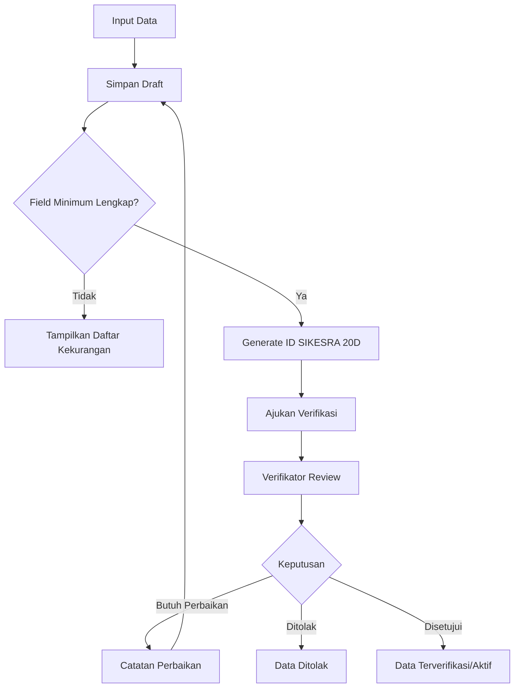

# PRD Khusus UI/UX SIKESRA Berbasis AWCMS Mini Single-Tenant

**Versi:** 0.2 UI/UX Draft Sinkron Repository  
**Basis Dokumen:** PRD MVP SIKESRA Berbasis AWCMS Mini Single-Tenant dan Sheet Kelengkapan Excel  
**Fokus:** Antarmuka pengguna, pengalaman pengguna, alur input, verifikasi, dashboard, dokumen, import/export, audit, dan akses berbasis wilayah  
**Platform:** AWCMS Mini single-tenant, PostgreSQL, Kysely, Cloudflare Worker runtime, Cloudflare R2 private bucket, dan PostgreSQL pada VPS yang dikelola melalui Coolify  
**Prioritas UX:** sederhana, jelas, aman, mudah digunakan operator pemerintah daerah, region-aware, audit-friendly, dan siap dikembangkan bertahap

---

## 1. Ringkasan Eksekutif

PRD UI/UX ini merinci rancangan antarmuka dan pengalaman pengguna untuk MVP SIKESRA berbasis **AWCMS Mini single-tenant**. Fokus utama UI/UX adalah membantu petugas, verifikator, admin wilayah, pimpinan, dan auditor mengelola data kesejahteraan rakyat/keagamaan/sosial secara mudah, aman, terstruktur, dan dapat dipertanggungjawabkan.

Dokumen teknis sumber menegaskan bahwa SIKESRA MVP harus dibangun sebagai aplikasi single-tenant berbasis AWCMS Mini, menggunakan PostgreSQL, Kysely, RBAC/ABAC, audit log, dokumen berbasis R2/object storage, serta form yang mengikuti sheet “Kelengkapan”. Karena itu, PRD UI/UX ini tidak merancang sistem sebagai aplikasi multi-tenant kompleks, melainkan sebagai aplikasi pemerintah daerah yang sederhana tetapi kuat secara tata kelola.

### Catatan Sinkronisasi Repository Saat Ini

1. Repository implementasi writable adalah `ahliweb/sikesra`; `ahliweb/awcms-mini` hanya referensi read-only.
2. Runtime produksi yang ditinjau adalah Cloudflare Worker pada `https://sikesrakobar.ahlikoding.com`.
3. Alias admin yang ditinjau adalah `/_emdash/` pada host yang sama.
4. Dokumen/media menggunakan bucket R2 `sikesra` melalui binding `MEDIA_BUCKET`.
5. PostgreSQL produksi berada pada VPS yang dikelola melalui Coolify, dengan transport Worker yang ditinjau melalui binding `HYPERDRIVE`.
6. Terminologi modul umum menggunakan `Guru Agama`, bukan `Guru Ngaji`.
7. Baseline UI/UX repository saat ini sudah mencakup `Agama` sebagai reference field terkontrol dan modul `Lansia Terlantar` sebagai follow-on MVP yang aktif di issue tracker dan model layer UI.

### Tujuan UI/UX Utama

1. Menyediakan dashboard ringkas untuk pimpinan dan admin.
2. Menyediakan form input yang sesuai field sheet Kelengkapan.
3. Menyederhanakan proses input data yang panjang melalui section, wizard, dan autosave.
4. Membuat workflow draft → submitted → verified/need_revision/rejected/active mudah dipahami.
5. Menampilkan kodefikasi **ID SIKESRA 20 digit** secara jelas sebagai identitas bisnis resmi.
6. Memastikan data sensitif seperti NIK/KIA, agama individu, data anak, data disabilitas, dan data lansia rentan tidak tampil sembarangan.
7. Menyediakan daftar, filter, pencarian, import, export, dokumen, verifikasi, dan audit log yang mudah dipakai.
8. Mendukung pembatasan akses berbasis role, permission, wilayah resmi, wilayah custom, status data, dan klasifikasi data.

---

## 2. Prinsip Desain UI/UX

### 2.1 Prinsip Umum

| Prinsip | Penjelasan UI/UX |
|---|---|
| Simple-first | Tampilan awal harus sederhana; field lanjutan ditaruh dalam section collapsible atau tab. |
| Database-first | UI mengikuti struktur data dan status database, bukan sekadar tampilan spreadsheet. |
| Excel-first | Label field dan urutan input mengikuti sheet Kelengkapan agar familiar bagi petugas. |
| Region-aware | Filter, list, form, dan akses harus selalu mempertimbangkan provinsi, kabupaten/kota, kecamatan, desa/kelurahan, dan wilayah custom. |
| Secure-by-default | Data sensitif dimasking, dibatasi, dan membutuhkan permission/step-up authentication bila perlu. |
| Audit-friendly | Setiap aksi penting menampilkan jejak perubahan dan status terakhir. |
| Verification-centered | Proses verifikasi menjadi bagian inti UX, bukan fitur tambahan. |
| Progressive disclosure | Field kompleks hanya ditampilkan saat dibutuhkan. |
| Government-ready | Bahasa formal, mudah dipahami, cocok untuk operator desa/kecamatan/kabupaten. |

### 2.2 Prinsip Bahasa Antarmuka

Bahasa UI menggunakan bahasa Indonesia formal dan praktis.

Contoh label:

- “Tambah Rumah Ibadah”
- “Simpan Draft”
- “Ajukan Verifikasi”
- “Butuh Perbaikan”
- “Data Terverifikasi”
- “Dokumen Belum Lengkap”
- “ID SIKESRA 20 Digit”
- “Wilayah Resmi Kemendagri”
- “Wilayah Custom/Dusun/RT/RW”

Hindari istilah teknis seperti `entity`, `object_type_code`, `UUID`, atau `middleware` pada UI operator. Istilah teknis hanya tampil di halaman admin teknis atau audit detail.

---

## 3. Persona Pengguna

| Persona | Peran | Kebutuhan Utama | Risiko UX |
|---|---|---|---|
| Super Admin | Mengelola seluruh sistem | Role, permission, master data, konfigurasi, audit | Salah konfigurasi akses |
| Admin Kabupaten | Mengelola data seluruh kabupaten | Dashboard, validasi lintas kecamatan, export laporan | Data terlalu banyak dan sulit difilter |
| Admin Kecamatan | Mengelola data per kecamatan | Rekap desa/kelurahan, monitoring input | Bingung membedakan wilayah resmi dan custom |
| Admin Desa/Kelurahan | Mengelola data wilayahnya | Input dan update data lokal | Form terlalu panjang |
| Petugas Input | Input data lapangan | Form cepat, validasi jelas, upload dokumen | Kesalahan field, duplikasi, dokumen salah |
| Verifikator | Memeriksa dan menyetujui data | Review perubahan, dokumen, status, catatan | Keputusan verifikasi tanpa konteks lengkap |
| Pimpinan/Viewer | Melihat rekap dan dashboard | Statistik, peta, export, ringkasan | Terpapar data sensitif yang tidak perlu |
| Auditor | Memeriksa jejak aktivitas | Audit log, perubahan data, export log | Log sulit dipahami |

---

## 4. Struktur Navigasi Admin

### 4.1 Menu Utama

Menu admin mengikuti daftar menu MVP dalam dokumen PRD teknis.

```text
Dashboard SIKESRA
Registry Data
  - Semua Data
  - Rumah Ibadah
  - Lembaga Keagamaan
  - Pendidikan Keagamaan
  - Kesejahteraan Sosial
  - Guru Agama
  - Anak Yatim
  - Disabilitas
  - Lansia Terlantar
Verifikasi Data
Dokumen Pendukung
Import Excel
Laporan & Export
Wilayah & Kodefikasi
Audit Log
Pengguna & Akses
Pengaturan
```

### 4.2 Aturan Visibilitas Menu

| Menu | Super Admin | Admin Kabupaten | Admin Kecamatan | Admin Desa | Petugas Input | Verifikator | Pimpinan | Auditor |
|---|---:|---:|---:|---:|---:|---:|---:|---:|
| Dashboard | Ya | Ya | Ya | Ya | Ringkas | Ya | Ya | Ringkas |
| Registry Data | Ya | Ya | Ya | Ya | Ya | Ya | Ya | Baca |
| Verifikasi Data | Ya | Ya | Ya | Terbatas | Tidak | Ya | Tidak | Baca |
| Dokumen Pendukung | Ya | Ya | Ya | Ya | Upload | Review | Terbatas | Baca |
| Import Excel | Ya | Ya | Terbatas | Tidak | Terbatas | Tidak | Tidak | Tidak |
| Laporan & Export | Ya | Ya | Ya | Terbatas | Tidak | Ya | Ya | Terbatas |
| Wilayah & Kodefikasi | Ya | Ya | Baca | Baca | Tidak | Baca | Tidak | Baca |
| Audit Log | Ya | Ya | Terbatas | Tidak | Tidak | Terbatas | Tidak | Ya |
| Pengguna & Akses | Ya | Ya | Terbatas | Tidak | Tidak | Tidak | Tidak | Tidak |
| Pengaturan | Ya | Terbatas | Tidak | Tidak | Tidak | Tidak | Tidak | Tidak |

---

## 5. Information Architecture

### 5.1 Struktur Halaman Modul

Setiap modul data utama memiliki struktur yang konsisten:

1. **List/Rekap**
2. **Tambah Data**
3. **Detail Data**
4. **Edit Data**
5. **Dokumen Pendukung**
6. **Riwayat Verifikasi**
7. **Riwayat Perubahan/Audit**
8. **Export per Modul**

### 5.2 Struktur Detail Entitas

```text
Header Detail
  - Nama Data
  - ID SIKESRA 20D
  - Jenis/Subjenis
  - Status Data
  - Status Verifikasi
  - Wilayah
  - Tombol aksi sesuai role

Tab Detail
  1. Ringkasan
  2. Data Utama
  3. Pengurus/Wali/Personil
  4. Dokumen
  5. Verifikasi
  6. Riwayat Perubahan
  7. Catatan
```

---

## 6. Dashboard UI/UX

### 6.1 Tujuan Dashboard

Dashboard harus menjawab pertanyaan utama:

1. Berapa total data per modul?
2. Berapa data yang sudah diverifikasi?
3. Berapa data yang masih draft/submitted/need_revision/rejected?
4. Wilayah mana yang datanya belum lengkap?
5. Dokumen apa yang paling banyak belum terpenuhi?
6. Data mana yang perlu segera ditindaklanjuti?

### 6.2 Widget Minimum

| Widget | Bentuk UI | Fungsi |
|---|---|---|
| Total Rumah Ibadah | Stat card | Menampilkan jumlah rumah ibadah |
| Total Lembaga Keagamaan | Stat card | Menampilkan jumlah lembaga keagamaan |
| Total Pendidikan Keagamaan | Stat card | Menampilkan jumlah lembaga pendidikan keagamaan |
| Total LKS | Stat card | Menampilkan lembaga kesejahteraan sosial |
| Total Guru Agama | Stat card | Menampilkan data guru agama |
| Total Anak Yatim | Stat card | Menampilkan data anak yatim/piatu/yatim-piatu |
| Total Disabilitas | Stat card | Menampilkan data penyandang disabilitas |
| Total Lansia Terlantar | Stat card | Menampilkan data lansia terlantar/rentan sosial |
| Status Verifikasi | Donut/bar chart | Distribusi draft/submitted/verified/need_revision/rejected |
| Rekap Kecamatan | Table/chart | Perbandingan jumlah data antar kecamatan |
| Rekap Desa/Kelurahan | Table | Data detail wilayah kerja |
| Dokumen Belum Lengkap | Alert list | Daftar prioritas kelengkapan dokumen |
| Aktivitas Terakhir | Timeline | Audit aktivitas terbaru |

### 6.3 Layout Dashboard

```text
[Filter Wilayah] [Filter Modul] [Filter Status] [Periode]

[Total Rumah Ibadah] [Total Lembaga] [Total Pendidikan] [Total LKS]
[Total Guru Agama]   [Total Anak Yatim] [Total Disabilitas] [Total Lansia]

[Grafik Status Verifikasi]        [Rekap per Kecamatan]
[Daftar Butuh Perbaikan]          [Aktivitas Terakhir]
```

### 6.4 Interaksi Dashboard

- Klik stat card membuka list data terfilter.
- Klik kecamatan membuka rekap desa/kelurahan.
- Klik status “Need Revision” membuka daftar data yang perlu perbaikan.
- Pimpinan hanya melihat agregat dan data yang aman.
- Data sensitif tidak tampil di dashboard.

---

## 7. UI List/Rekap Data

### 7.1 Kolom Wajib List View

Mengikuti dokumen teknis, list view minimal memuat:

| Kolom | Keterangan |
|---|---|
| ID SIKESRA 20D | Business identifier resmi; jika belum ada tampil “Belum dibuat” |
| Nama | Nama rumah ibadah/lembaga/orang |
| Jenis/Subjenis | Kategori modul |
| Desa/Kelurahan | Wilayah resmi |
| Kecamatan | Turunan wilayah resmi |
| Wilayah Custom | Dusun/RT/RW/zona bila ada |
| Status Data | draft/submitted/active/archived |
| Status Verifikasi | pending/verified/rejected/need_revision |
| Kelengkapan Dokumen | Persentase atau badge |
| Update Terakhir | Timestamp ringkas |
| Aksi | Detail, edit, submit, verify, export sesuai permission |

### 7.2 Filter Wajib

| Filter | Tipe UI | Catatan |
|---|---|---|
| Modul | Select | Semua/Rumah Ibadah/Lembaga/dll |
| Jenis/Subjenis | Multi-select | Bergantung modul |
| Kecamatan | Cascade select | Sesuai wilayah resmi |
| Desa/Kelurahan | Cascade select | Sesuai kecamatan |
| Wilayah Custom | Select/search | Dusun/RT/RW/zona |
| Status Data | Multi-select | draft/submitted/active/archived |
| Status Verifikasi | Multi-select | pending/verified/rejected/need_revision |
| Kelengkapan Dokumen | Select | lengkap/belum lengkap |
| Sumber Input | Select | manual/excel_import/field_survey |
| Tanggal Update | Date range | Untuk monitoring |

### 7.3 Fitur List View

- Pencarian cepat berdasarkan nama, ID SIKESRA, alamat, dan kontak.
- Simpan filter sebagai preset.
- Bulk action terbatas: export, submit batch, arsip batch, verifikasi batch bila diizinkan.
- Tombol “Tambah Data” jelas di kanan atas.
- Empty state berisi panduan: “Belum ada data. Tambahkan data baru atau import dari Excel.”
- Status sensitif ditandai badge “Data Terbatas” tanpa membuka isinya.

---

## 8. Form Pattern Global

### 8.1 Struktur Section Form

Setiap form menggunakan pola section berikut:

1. **Kode dan Kategori**
2. **Wilayah dan Alamat**
3. **Identitas Utama**
4. **Detail Khusus Modul**
5. **Pengurus/Wali/Personil Terkait**
6. **Dokumen Pendukung**
7. **Status dan Catatan**
8. **Ringkasan Sebelum Submit**

### 8.2 Form Mode

| Mode | Tujuan | UX |
|---|---|---|
| Create | Tambah data baru | Wizard/section bertahap |
| Edit Draft | Melengkapi data | Autosave dan indikator kelengkapan |
| Edit Need Revision | Memperbaiki data | Tampilkan catatan verifikator di atas field terkait |
| Read-only | Viewer/pimpinan/auditor | Field tidak dapat diedit; data sensitif dimasking |
| Verify | Verifikator review | Checklist, dokumen preview, catatan keputusan |

### 8.3 Validasi Form

| Jenis Validasi | Contoh |
|---|---|
| Required | Nama, alamat, desa/kelurahan, jenis/subjenis |
| Format | Email, nomor HP/WA, tahun hibah, nominal |
| Kondisional | Subjenis sensorik wajib bila jenis disabilitas = Sensorik |
| Sensitif | NIK/KIA tidak boleh tampil penuh tanpa permission |
| Duplikasi | Peringatan bila nama + desa + jenis mirip data lama |
| Dokumen | Validasi tipe file, ukuran, MIME, checksum |
| Wilayah | Desa/kelurahan harus sesuai kecamatan |

### 8.4 Komponen UX Penting

- Autosave draft.
- Progress kelengkapan form.
- Inline validation di bawah field.
- Warning sebelum keluar bila ada perubahan belum tersimpan.
- Preview ringkasan sebelum submit.
- Badge status data dan verifikasi.
- Tombol aksi kontekstual: Simpan Draft, Generate ID, Ajukan Verifikasi, Setujui, Tolak, Minta Perbaikan.

---

## 9. UI Kodefikasi ID SIKESRA 20 Digit

### 9.1 Tujuan UI Kodefikasi

ID SIKESRA 20 digit adalah business identifier resmi. UI harus membantu pengguna memahami bahwa ID ini:

- dibuat otomatis;
- tidak diedit manual oleh operator biasa;
- berdasarkan kode desa/kelurahan resmi, jenis, subjenis, dan sequence;
- tidak berubah walau nama/pengurus/dokumen berubah;
- tidak memasukkan wilayah custom seperti dusun/RT/RW.

### 9.2 Tampilan ID pada Form

Di bagian paling atas form/detail:

```text
ID SIKESRA
[Belum dibuat]  [Generate ID]

Format: [kode desa 10 digit][jenis 2 digit][subjenis 2 digit][nomor urut 6 digit]
Contoh: 62010210050101000001
```

### 9.3 State UI ID

| State | Tampilan | Aksi |
|---|---|---|
| Belum memenuhi syarat | Badge abu-abu “Belum dapat dibuat” | Tombol disabled; tampil daftar field kurang |
| Siap generate | Badge biru “Siap dibuat” | Tombol Generate ID aktif |
| Sudah dibuat | Badge hijau berisi ID 20D | Copy ID, lihat struktur ID |
| Perlu koreksi | Badge merah “Perlu koreksi khusus” | Hanya admin khusus |

### 9.4 Modal Penjelasan ID

Saat klik “Lihat struktur ID”, tampil:

| Bagian | Nilai | Arti |
|---|---|---|
| 6201021005 | Kode desa/kelurahan resmi | Sumber wilayah resmi |
| 01 | Jenis data | Rumah Ibadah |
| 01 | Subjenis data | Masjid |
| 000001 | Nomor urut | Sequence per desa+jenis+subjenis |

---

## 10. UI Modul Rumah Ibadah

### 10.1 Tujuan Modul

Memudahkan pendataan masjid, musholla, surau, gereja, pura, wihara, klenteng, dan jenis lain sesuai sheet Kelengkapan.

### 10.2 Section Form

#### A. Kode dan Kategori

| Field | Komponen | Catatan UX |
|---|---|---|
| Jenis Rumah Ibadah | Select | Masjid, Musholla, Surau, Gereja, Pura, Wihara, Klenteng |
| ID SIKESRA | Read-only/generated | Tombol generate bila syarat terpenuhi |
| ID Masjid | Text | Tampil kondisional bila jenis = Masjid |

#### B. Identitas dan Wilayah

| Field | Komponen | Catatan UX |
|---|---|---|
| Nama Rumah Ibadah | Text | Required |
| Alamat | Textarea | Required, placeholder format alamat lengkap |
| Kecamatan | Cascade select | Dari wilayah resmi |
| Desa/Kelurahan | Cascade select | Required |
| Wilayah Custom/Dusun/RT/RW | Select/input | Tidak masuk ID 20D |
| Koordinat | Lat/long input + tombol ambil lokasi | Opsional MVP |

#### C. Pengurus

| Field | Komponen | Catatan UX |
|---|---|---|
| Ketua - Nama | Text | Opsional tetapi disarankan |
| Ketua - NIK | Sensitive text | Masking otomatis |
| Sekretaris - Nama/NIK | Text + sensitive | Opsional |
| Bendahara - Nama/NIK | Text + sensitive | Opsional |
| Telepon/WA Ketua | Phone input | Validasi nomor |
| Email Lembaga/Pengurus | Email input | Validasi email |

#### D. Petugas Keagamaan

Repeatable rows:

- Imam Tetap - Nama/NIK
- Bilal - Nama/NIK
- Marbot - Nama/NIK

UX:

- Gunakan tombol “Tambah Imam”, “Tambah Bilal”, “Tambah Marbot”.
- NIK dimasking.
- Bisa hapus row sebelum submit.

#### E. Hibah

| Field | Komponen | Catatan UX |
|---|---|---|
| Pernah Menerima Hibah | Radio Ya/Tidak | Jika Tidak, field hibah disembunyikan |
| Hibah Provinsi - Tahun | Year input | Kondisional |
| Hibah Provinsi - Nominal | Currency input | Kondisional |
| Hibah Kabupaten - Tahun | Year input | Kondisional |
| Hibah Kabupaten - Nominal | Currency input | Kondisional |

#### F. Dokumen

| Dokumen | Komponen | Catatan |
|---|---|---|
| SK Kepengurusan | File upload | Disarankan MVP |
| Dokumen ID Masjid | File upload | Kondisional Masjid |
| Foto Bangunan | File upload/image | Disarankan MVP |

---

## 11. UI Modul Lembaga Keagamaan

### 11.1 Section Form

| Section | Field Utama |
|---|---|
| Kode dan Kategori | Agama, nama lembaga, ID SIKESRA |
| Wilayah dan Alamat | Alamat, kecamatan, desa/kelurahan, wilayah custom |
| Detail Kegiatan | Bidang kegiatan |
| Pengurus | Ketua, sekretaris, bendahara, NIK masing-masing |
| Dokumen | SK Pendirian, SK Kepengurusan, Dokumentasi Kegiatan |
| Kontak | Telepon/WA, email |

### 11.2 UX Nama Lembaga Islam Awal

Untuk agama Islam, dropdown awal dapat berisi:

1. Majelis Ulama Indonesia
2. Nahdlatul Ulama
3. Muhammadiyah
4. Lembaga Pengembangan Tilawatil Qur'an (LPTQ)
5. Lembaga Seni Qasidah Indonesia (LASQI)
6. Lembaga Dakwah Islam Indonesia (LDII)
7. Panitia Hari-hari Besar Islam (PHBI)
8. Lainnya

Jika memilih “Lainnya”, field text “Nama Lembaga Lainnya” muncul.

---

## 12. UI Modul Lembaga Pendidikan Keagamaan

### 12.1 Kategori

- TPA/TPQ
- Pondok Pesantren
- Lainnya bila ditambahkan admin

### 12.2 Section Form

| Section | Field Utama |
|---|---|
| Kode dan Kategori | Jenis lembaga pendidikan, ID SIKESRA |
| Identitas | Nama lembaga, alamat |
| Wilayah | Kecamatan, desa/kelurahan, wilayah custom |
| Legalitas | Badan hukum, SK Kepengurusan |
| Kegiatan | Bidang kegiatan, dokumentasi kegiatan |
| SDM dan Santri | Jumlah pengajar, jumlah santri |
| Pengurus | Ketua, sekretaris, bendahara, NIK masing-masing |
| Kontak | Telepon/WA, email |

### 12.3 UX Kondisional

- Jika jenis = Pondok Pesantren, tampilkan hint “Pastikan data legalitas dan jumlah santri diperbarui.”
- Jika jumlah santri = 0 atau kosong, tampilkan warning non-blocking.
- Dokumentasi kegiatan dapat berupa upload file atau catatan teks.

---

## 13. UI Modul Lembaga Kesejahteraan Sosial

### 13.1 Kategori

- Baznas
- PWRI
- Panti Asuhan
- Panti Yatim
- Panti Jompo
- Rukun Kematian
- Majelis Taklim

### 13.2 Section Form

| Section | Field Utama |
|---|---|
| Kode dan Kategori | Jenis LKS, ID SIKESRA |
| Identitas | Nama lembaga, alamat |
| Wilayah | Kecamatan, desa/kelurahan, wilayah custom |
| Legalitas | Badan hukum, SK Kepengurusan |
| Kegiatan | Bidang kegiatan, dokumentasi kegiatan |
| Layanan/Pengasuhan | Jumlah pengasuh, jumlah anak asuh |
| Pengurus | Ketua, sekretaris, bendahara, NIK masing-masing |
| Kontak | Telepon/WA, email |

### 13.3 UX Khusus

- Jika jenis = Panti Asuhan/Panti Yatim/Panti Jompo, tampilkan section “Jumlah Pengasuh dan Penerima Manfaat”.
- Jika jenis = Rukun Kematian, label “Jumlah Anak Asuh” dapat disembunyikan agar tidak membingungkan.
- Sistem harus mendukung field yang sama secara database, tetapi UI bisa menyesuaikan konteks subjenis.

---

## 14. UI Modul Guru Agama

### 14.1 Section Form

| Section | Field Utama |
|---|---|
| Identitas | Nama lengkap, NIK, TTL |
| Wilayah | Alamat rumah, kecamatan, desa/kelurahan, wilayah custom |
| Status Guru | Rumahan/Lembaga |
| Agama | Agama guru dari referensi terkontrol |
| Data Lembaga | Nama TKA/TPA, alamat TKA/TPA |
| Kontak | Telepon/WA, email |
| Status dan Catatan | Status data, catatan verifikator |

### 14.2 UX Kondisional

- Jika status guru agama = Rumahan, field Nama TKA/TPA dan Alamat TKA/TPA disembunyikan.
- Jika status = Lembaga, field lembaga ditampilkan dan diberi rekomendasi untuk diisi.
- NIK masuk kategori highly restricted dan dimasking.

---

## 16A. UI Modul Lansia Terlantar

### 16A.1 Prinsip Privasi UX

Data lansia terlantar harus diperlakukan sebagai data kelompok rentan. Pimpinan/viewer hanya melihat agregat atau data yang sudah diminimalkan sesuai kewenangan.

### 16A.2 Section Form

| Section | Field Utama |
|---|---|
| Kategori | Kategori lansia terlantar, status data |
| Identitas Lansia | Nama lengkap, NIK, tempat/tanggal lahir atau perkiraan umur, jenis kelamin |
| Agama dan Wilayah | Agama lansia, alamat, kecamatan, desa/kelurahan, wilayah custom |
| Kondisi Sosial | Kondisi tempat tinggal, kondisi keterlantaran, kebutuhan prioritas |
| Pendamping/Penanggung Jawab | Nama pendamping, hubungan, agama pendamping, kontak |
| Status dan Catatan | Status verifikasi, catatan petugas, catatan verifikator |

### 16A.3 UX Keamanan

- Tampilkan warning: `Data lansia terlantar termasuk data pribadi dan data kelompok rentan. Gunakan hanya sesuai kewenangan, kebutuhan layanan, dan ketentuan perlindungan data yang berlaku.`
- NIK, kontak, kondisi hidup, dan catatan kesehatan harus dimasking atau dibatasi sesuai permission.
- Field agama bersifat permission-aware dan menggunakan referensi terkontrol, bukan free text.
- Export data individual lansia harus membutuhkan permission khusus dan konfirmasi audit-aware.

---

## 15. UI Modul Anak Yatim

### 15.1 Prinsip Privasi UX

Data anak harus ditampilkan dengan prinsip data minimization. Pimpinan/viewer cukup melihat agregat atau data terbatasi. NIK/KIA tidak boleh tampil penuh kecuali user memiliki permission khusus.

### 15.2 Section Form

| Section | Field Utama |
|---|---|
| Kategori | Anak Yatim, Anak Piatu, Anak Yatim Piatu |
| Identitas Anak | Nama lengkap, NIK/KIA, TTL, jenis kelamin |
| Wilayah dan Alamat | Alamat, kecamatan, desa/kelurahan, wilayah custom |
| Pendidikan | Jenjang sekolah, nama sekolah |
| Wali/Pengasuh | Nama wali/pengasuh, NIK wali, hubungan keluarga |
| Dokumen | Upload KK |
| Kontak Wali | Telepon/WA wali, email wali |
| Status dan Catatan | Status verifikasi, catatan |

### 15.3 UX Keamanan

- Tampilkan warning: “Data anak termasuk data sensitif. Gunakan hanya untuk keperluan pendataan resmi.”
- Masking NIK/KIA: `6201************1234`.
- Export data anak harus membutuhkan permission khusus.
- Detail anak untuk viewer hanya menampilkan nama inisial atau data terbatas bila kebijakan mengharuskan.

---

## 16. UI Modul Disabilitas

### 16.1 Section Form

| Section | Field Utama |
|---|---|
| Identitas | Nama lengkap, NIK/KIA, TTL, jenis kelamin |
| Wilayah | Alamat, kecamatan, desa/kelurahan, wilayah custom |
| Data Disabilitas | Jenis disabilitas, subjenis sensorik, tingkat keparahan |
| Wali/Pengasuh | Nama wali, alamat wali, telepon/WA, email |
| Status dan Catatan | Status verifikasi, catatan |

### 16.2 UX Kondisional

- Jika jenis disabilitas = Sensorik, tampilkan subjenis: Tuna Netra, Tuna Rungu, Tuna Wicara.
- Jika jenis disabilitas ≠ Sensorik, field subjenis sensorik disembunyikan.
- Tingkat keparahan wajib: Ringan/Sedang/Berat.
- Data disabilitas ditandai sebagai highly restricted.

---

## 17. UI Dokumen Pendukung dan File Upload

### 17.1 Komponen Upload

Setiap upload dokumen memiliki:

- jenis dokumen;
- pilih file;
- nomor dokumen bila ada;
- penerbit dokumen;
- tanggal terbit;
- tanggal kedaluwarsa bila ada;
- catatan;
- status verifikasi dokumen;
- preview file bila aman;
- riwayat upload dan verifikasi.

### 17.2 Jenis Dokumen

| Kode | Nama Dokumen | Modul |
|---|---|---|
| SK_KEPENGURUSAN | SK Kepengurusan | Rumah Ibadah, Lembaga Keagamaan, Pendidikan Keagamaan, LKS |
| SK_PENDIRIAN | SK Pendirian | Lembaga Keagamaan |
| BADAN_HUKUM | Badan Hukum | Pendidikan Keagamaan, LKS |
| ID_MASJID | Dokumen ID Masjid | Rumah Ibadah |
| FOTO_BANGUNAN | Foto Bangunan | Rumah Ibadah |
| DOKUMENTASI_KEGIATAN | Dokumentasi Kegiatan | Lembaga Keagamaan, Pendidikan, LKS |
| KARTU_KELUARGA | Kartu Keluarga | Anak Yatim |
| DOKUMEN_LAIN | Dokumen Lain | Semua modul |

### 17.3 UX Validasi File

- Validasi MIME dan ekstensi.
- Batas ukuran file ditampilkan sebelum upload.
- Progress bar upload.
- Checksum otomatis di backend.
- File sensitif tidak bisa dibuka langsung tanpa permission.
- Preview gambar/PDF hanya untuk user berwenang.
- Tombol “Ganti Dokumen” membuat dokumen lama menjadi superseded, bukan menghapus permanen.

---

## 18. UI Workflow Verifikasi

### 18.1 Status Data

| Status | Arti | Tampilan |
|---|---|---|
| draft | Data masih disusun | Badge abu-abu |
| submitted | Data diajukan | Badge biru |
| verified | Data lolos verifikasi | Badge hijau |
| need_revision | Perlu perbaikan | Badge kuning/oranye |
| rejected | Ditolak | Badge merah |
| active | Data aktif | Badge hijau solid |
| archived | Diarsipkan | Badge abu-abu gelap |

### 18.2 Alur UI



### 18.3 Halaman Review Verifikator

Komponen wajib:

- Ringkasan data.
- Perbandingan perubahan terakhir.
- Kelengkapan field minimum.
- Kelengkapan dokumen.
- Validasi wilayah.
- Catatan petugas input.
- Catatan verifikator.
- Keputusan: Verifikasi, Butuh Perbaikan, Tolak.

### 18.4 UX Need Revision

Jika verifikator memilih “Butuh Perbaikan”, wajib mengisi:

- section/field yang perlu diperbaiki;
- catatan perbaikan;
- prioritas perbaikan;
- batas waktu opsional.

Pada form petugas, field bermasalah diberi highlight dan catatan verifikator tampil dekat field tersebut.

---

## 19. UI Import Excel

### 19.1 Prinsip UX Import

Import Excel tidak langsung masuk data master. Pengguna harus memahami bahwa semua data masuk staging untuk diperiksa.

### 19.2 Alur Import

```text
Upload Excel → Pilih Sheet → Mapping Kolom → Validasi → Review Staging → Promote ke Master → Generate ID bila valid
```

### 19.3 Halaman Import

| Step | Tampilan | Aksi |
|---|---|---|
| 1. Upload | Dropzone file Excel | Upload |
| 2. Pilih Sheet | Checkbox/list sheet | Pilih sheet yang diproses |
| 3. Mapping | Tabel mapping kolom Excel ke field sistem | Simpan mapping |
| 4. Validasi | Ringkasan valid/invalid/needs_review | Lihat error |
| 5. Review | Tabel staging rows | Edit staging/promote |
| 6. Selesai | Statistik import | Lihat hasil |

### 19.4 UI Error Import

Contoh pesan:

- “Kode desa/kelurahan belum ditemukan.”
- “Nama wajib diisi.”
- “Format tanggal lahir tidak valid.”
- “NIK/KIA memiliki panjang tidak sesuai.”
- “Data mirip sudah ada di sistem.”

---

## 20. UI Laporan dan Export

### 20.1 Jenis Laporan MVP

1. Rekap seluruh data per modul.
2. Rekap per kecamatan.
3. Rekap per desa/kelurahan.
4. Rekap status verifikasi.
5. Rekap kelengkapan dokumen.
6. Rekap rumah ibadah per jenis.
7. Rekap lembaga keagamaan per agama.
8. Rekap anak yatim per jenjang sekolah.
9. Rekap disabilitas per jenis dan tingkat keparahan.
10. Rekap data need_revision/rejected.

### 20.2 UX Export

- Format minimal: CSV/XLSX.
- PDF dapat menjadi backlog bila belum masuk MVP teknis.
- Export data sensitif membutuhkan permission khusus.
- Sebelum export, tampilkan modal:

```text
Anda akan mengekspor data.
Pastikan data digunakan sesuai kewenangan dan kebutuhan dinas.
[ ] Saya memahami bahwa data sensitif tidak boleh disebarluaskan tanpa dasar kewenangan.
```

---

## 21. UI Wilayah Resmi dan Wilayah Custom

### 21.1 Prinsip UX Wilayah

Wilayah resmi dan wilayah custom harus dibedakan jelas.

| Jenis Wilayah | Contoh | Fungsi | Masuk ID SIKESRA? |
|---|---|---|---|
| Wilayah resmi | Kecamatan, desa/kelurahan | Dasar administratif | Ya, kode desa 10 digit |
| Wilayah custom | Dusun, RT, RW, blok, zona layanan | Operasional lokal | Tidak |

### 21.2 Komponen Wilayah

- Cascade select: kabupaten/kota → kecamatan → desa/kelurahan.
- Wilayah custom sebagai select/input setelah desa dipilih.
- Tooltip: “Wilayah custom hanya untuk operasional dan tidak menggantikan kode wilayah resmi.”

---

## 22. UI Audit Log

### 22.1 Halaman Audit Log

Kolom minimum:

| Kolom | Keterangan |
|---|---|
| Waktu | Timestamp aksi |
| User | Pelaku aksi |
| Role | Role saat aksi |
| Modul | Modul terkait |
| Entitas | Nama/ID data |
| Aksi | create/update/delete_soft/generate_code/submit/verify/upload/export |
| Ringkasan | Deskripsi singkat |
| IP/Device | Jika tersedia |
| Detail | Tombol buka detail |

### 22.2 UX Detail Audit

Detail audit menampilkan:

- sebelum dan sesudah perubahan;
- field yang berubah;
- alasan/catatan bila ada;
- permission yang digunakan;
- status sukses/gagal;
- metadata teknis terbatas untuk admin/auditor.

---

## 23. UI Pengguna, Role, Permission, dan ABAC

### 23.1 Halaman Pengguna

Kolom:

- nama;
- email/username;
- role;
- wilayah kerja;
- status akun;
- 2FA aktif/tidak;
- login terakhir;
- aksi.

### 23.2 Form User

Field:

- nama lengkap;
- email/username;
- role;
- wilayah kerja resmi;
- wilayah custom opsional;
- status aktif/nonaktif;
- wajib 2FA untuk role sensitif;
- catatan admin.

### 23.3 Permission Matrix UI

Gunakan tabel matriks:

| Permission | Super Admin | Admin Kab | Admin Kec | Admin Desa | Petugas | Verifikator | Viewer | Auditor |
|---|---|---|---|---|---|---|---|---|
| sikesra.entity.read | ✓ | ✓ | ✓ | ✓ | ✓ | ✓ | ✓ | ✓ |
| sikesra.entity.create | ✓ | ✓ | ✓ | ✓ | ✓ | - | - | - |
| sikesra.entity.update | ✓ | ✓ | ✓ | ✓ | ✓ | Terbatas | - | - |
| sikesra.entity.generate_code | ✓ | ✓ | Terbatas | Terbatas | Terbatas | - | - | - |
| sikesra.verification.verify | ✓ | ✓ | ✓ | - | - | ✓ | - | - |
| sikesra.audit.read | ✓ | ✓ | Terbatas | - | - | Terbatas | - | ✓ |

---

## 24. Desain Komponen UI

### 24.1 Komponen Global

| Komponen | Fungsi |
|---|---|
| Stat Card | Menampilkan jumlah data ringkas |
| Badge Status | Status data/verifikasi/dokumen |
| Cascade Select Wilayah | Memilih wilayah resmi |
| Sensitive Field | Masking NIK/KIA |
| Document Upload Card | Upload dan review dokumen |
| Verification Panel | Review dan keputusan verifikasi |
| Audit Timeline | Riwayat perubahan |
| Completeness Meter | Persentase kelengkapan data |
| Duplicate Warning | Peringatan data mirip |
| Export Confirmation Modal | Kontrol ekspor data |

### 24.2 Badge Status

| Status | Label UI |
|---|---|
| draft | Draft |
| submitted | Diajukan |
| verified | Terverifikasi |
| need_revision | Perlu Perbaikan |
| rejected | Ditolak |
| active | Aktif |
| archived | Arsip |
| pending | Menunggu |
| incomplete | Belum Lengkap |

---

## 25. Wireframe Tekstual

### 25.1 Dashboard

```text
+---------------------------------------------------------------+
| SIKESRA Dashboard                         [Wilayah] [Periode] |
+---------------------------------------------------------------+
| Rumah Ibadah | Lembaga | Pendidikan | LKS | Guru | Yatim | Disabilitas |
+---------------------------------------------------------------+
| Status Verifikasi Chart       | Rekap Kecamatan               |
|                               |                                |
+---------------------------------------------------------------+
| Data Perlu Perbaikan          | Dokumen Belum Lengkap          |
+---------------------------------------------------------------+
| Aktivitas Terakhir                                             |
+---------------------------------------------------------------+
```

### 25.2 List Data

```text
+---------------------------------------------------------------+
| Rumah Ibadah                               [+ Tambah Data]     |
+---------------------------------------------------------------+
| Filter: Kecamatan | Desa | Jenis | Status | Dokumen | Cari     |
+---------------------------------------------------------------+
| ID SIKESRA | Nama | Jenis | Desa | Status | Dokumen | Aksi     |
| ...                                                           |
+---------------------------------------------------------------+
```

### 25.3 Form Input

```text
+---------------------------------------------------------------+
| Tambah Rumah Ibadah                                           |
| ID SIKESRA: Belum dibuat                                      |
+---------------------------------------------------------------+
| [1 Kode & Kategori] [2 Wilayah] [3 Identitas] [4 Pengurus]    |
| [5 Hibah] [6 Dokumen] [7 Ringkasan]                           |
+---------------------------------------------------------------+
| Section aktif                                                 |
| Field...                                                      |
+---------------------------------------------------------------+
| [Simpan Draft] [Generate ID] [Ajukan Verifikasi]              |
+---------------------------------------------------------------+
```

### 25.4 Detail dan Verifikasi

```text
+---------------------------------------------------------------+
| Nama Data                                                     |
| ID SIKESRA: 62010210050101000001 | Status: Diajukan           |
+---------------------------------------------------------------+
| Ringkasan | Data Utama | Personil | Dokumen | Verifikasi | Log |
+---------------------------------------------------------------+
| Panel kiri: Data                                               |
| Panel kanan: Kelengkapan + Catatan Verifikator                 |
+---------------------------------------------------------------+
| [Minta Perbaikan] [Tolak] [Verifikasi]                         |
+---------------------------------------------------------------+
```

---

## 26. Accessibility dan Usability

### 26.1 Standar Minimum

- Kontras teks cukup jelas.
- Semua tombol memiliki label eksplisit.
- Field wajib diberi tanda dan pesan validasi.
- Navigasi keyboard untuk form penting.
- Error message jelas dan tidak menyalahkan pengguna.
- Tabel responsif dengan horizontal scroll di layar kecil.
- Gunakan bahasa sederhana untuk operator non-teknis.

### 26.2 Pesan Error yang Baik

| Buruk | Baik |
|---|---|
| Invalid input | Format email belum benar. Contoh: nama@domain.go.id |
| Required | Nama Rumah Ibadah wajib diisi. |
| Access denied | Anda tidak memiliki akses ke data wilayah ini. Hubungi admin kabupaten bila perlu. |
| Upload failed | Upload gagal. Pastikan file PDF/JPG/PNG dan ukuran tidak melebihi batas. |

---

## 27. Keamanan dan Privasi dalam UI/UX

### 27.1 Data Sensitif

Data berikut harus diperlakukan sebagai restricted/highly restricted:

- NIK pengurus;
- NIK/KIA anak;
- data anak yatim/piatu/yatim-piatu;
- data disabilitas;
- Kartu Keluarga;
- dokumen badan hukum tertentu;
- kontak pribadi wali/pengasuh bila dianggap sensitif.

### 27.2 Aturan Tampilan

| Kondisi | Tampilan |
|---|---|
| User tidak punya permission | Field disembunyikan atau dimasking |
| User punya permission baca terbatas | Tampil sebagian, contoh `6201********1234` |
| User punya permission penuh | Tampil penuh setelah alasan akses/step-up bila diaktifkan |
| Export data sensitif | Butuh permission khusus dan audit log |

### 27.3 UX Peringatan Privasi

Pada modul Anak Yatim dan Disabilitas tampil banner:

```text
Data pada halaman ini termasuk data pribadi dan/atau data rentan. Gunakan hanya sesuai kewenangan, kebutuhan layanan, dan ketentuan perlindungan data yang berlaku.
```

---

## 28. Responsivitas

### 28.1 Desktop

Fokus utama MVP adalah desktop/laptop untuk operator kantor.

- Sidebar tetap.
- Tabel lebar.
- Form multi-section.
- Detail dua kolom.

### 28.2 Tablet

- Sidebar collapsible.
- Tabel menjadi card list bila layar sempit.
- Form section tetap bertahap.

### 28.3 Mobile

Mobile bukan prioritas utama MVP, tetapi UI harus tetap dapat dibuka untuk review ringan.

- Dashboard ringkas.
- List menjadi card.
- Form panjang dibagi step.
- Upload dari kamera/file bila didukung browser.

---

## 29. Acceptance Criteria UI/UX

### 29.1 Umum

1. Menu admin SIKESRA tersedia sesuai struktur MVP.
2. Dashboard menampilkan widget minimum per modul dan status verifikasi.
3. List data menampilkan kolom wajib dan filter utama.
4. Semua form mengikuti pattern section yang sama.
5. ID SIKESRA 20 digit tampil jelas dan dapat digenerate sesuai syarat.
6. Wilayah resmi dan wilayah custom dibedakan secara jelas.
7. Data sensitif dimasking sesuai role/permission.
8. Dokumen pendukung dapat diupload, direview, dan diverifikasi.
9. Workflow draft-submit-verify-need_revision-rejected-active dapat dilakukan dari UI.
10. Import Excel masuk staging dan menampilkan validasi sebelum masuk master.
11. Export laporan tersedia dengan konfirmasi keamanan.
12. Audit log dapat dibaca oleh role berwenang.
13. User tidak melihat menu/aksi yang tidak memiliki permission.
14. Pesan error mudah dipahami.
15. UI bisa digunakan pada desktop dan tablet secara nyaman.

### 29.2 Modul

| Modul | Acceptance Criteria UI |
|---|---|
| Rumah Ibadah | Form menampilkan jenis rumah ibadah, pengurus, hibah, ID masjid, dokumen, foto bangunan. |
| Lembaga Keagamaan | Form mendukung agama, nama lembaga master/lainnya, kegiatan, SK, dokumentasi. |
| Pendidikan Keagamaan | Form mendukung jenis pendidikan, jumlah pengajar, jumlah santri, badan hukum, kegiatan. |
| LKS | Form mendukung kategori LKS, jumlah pengasuh, jumlah anak asuh, legalitas, kegiatan. |
| Guru Agama | Form mendukung status rumahan/lembaga dan field lembaga kondisional. |
| Anak Yatim | Form mendukung kategori anak, NIK/KIA, pendidikan, wali, KK, kontak wali dengan proteksi privasi. |
| Disabilitas | Form mendukung jenis disabilitas, subjenis sensorik kondisional, tingkat keparahan, wali. |
| Lansia Terlantar | Form mendukung kategori lansia, agama terkontrol, kondisi sosial, pendamping, dan proteksi data kelompok rentan. |

---

## 30. Sprint UI/UX Implementasi

### Sprint UI/UX 1 — Fondasi Layout dan Navigasi

- Desain layout admin AWCMS Mini untuk SIKESRA.
- Sidebar menu dan route per modul.
- Komponen global: badge, stat card, table, filter, form section.
- Role-aware menu visibility.

### Sprint UI/UX 2 — Dashboard dan Registry Data

- Dashboard widget minimum.
- List semua data.
- Filter wilayah/status/modul.
- Detail registry umum.

### Sprint UI/UX 3 — Form Modul Utama

- Rumah Ibadah.
- Lembaga Keagamaan.
- Pendidikan Keagamaan.
- LKS.
- Guru Agama.
- Anak Yatim.
- Disabilitas.
- Lansia Terlantar.

### Sprint UI/UX 4 — Kodefikasi, Dokumen, dan Verifikasi

- UI generate ID 20D.
- Upload dokumen.
- Dokumen verification panel.
- Workflow submit/verify/reject/need revision.

### Sprint UI/UX 5 — Import, Export, Audit, dan Pengguna

- Import Excel staging UI.
- Export laporan UI.
- Audit log viewer.
- User, role, permission, region scope UI.
- Final usability test.

---

## 31. Contoh Skenario Pengguna

### Skenario 1 — Petugas Input Menambah Rumah Ibadah

1. Petugas membuka menu Rumah Ibadah.
2. Klik “Tambah Data”.
3. Memilih jenis “Masjid”.
4. Mengisi nama, alamat, kecamatan, desa, dan wilayah custom.
5. Mengisi pengurus.
6. Upload SK Kepengurusan dan Foto Bangunan.
7. Sistem menampilkan field minimum lengkap.
8. Petugas klik Generate ID.
9. Petugas klik Ajukan Verifikasi.

### Skenario 2 — Verifikator Meminta Perbaikan Data Anak Yatim

1. Verifikator membuka menu Verifikasi Data.
2. Memfilter status “submitted”.
3. Membuka detail anak yatim.
4. Melihat NIK/KIA dalam kondisi dimasking atau penuh sesuai permission.
5. Mengecek dokumen KK.
6. Menemukan hubungan wali belum jelas.
7. Klik “Butuh Perbaikan”.
8. Mengisi catatan pada field Hubungan Wali.
9. Petugas menerima status need_revision.

### Skenario 3 — Admin Kabupaten Import Excel

1. Admin membuka Import Excel.
2. Upload workbook.
3. Memilih sheet yang ingin diproses.
4. Mapping kolom ke field sistem.
5. Sistem memvalidasi dan menampilkan row valid/invalid/needs_review.
6. Admin memperbaiki staging row.
7. Data dipromosikan ke master.
8. ID SIKESRA dibuat setelah field minimum valid.

### Skenario 4 — Pimpinan Melihat Rekap

1. Pimpinan membuka Dashboard.
2. Memilih kecamatan tertentu.
3. Melihat total per modul dan status verifikasi.
4. Membuka laporan rekap per desa.
5. Mengekspor laporan agregat tanpa data sensitif.

### Skenario 5 — Auditor Menelusuri Perubahan ID

1. Auditor membuka Audit Log.
2. Memfilter aksi “generate_code”.
3. Membuka detail audit.
4. Melihat user, waktu, entity, kode desa, jenis, subjenis, dan sequence.
5. Mengekspor log bila memiliki izin.

---

## 32. Risiko UI/UX dan Mitigasi

| Risiko | Dampak | Mitigasi UI/UX |
|---|---|---|
| Form terlalu panjang | Petugas malas melengkapi data | Section bertahap, autosave, progress kelengkapan |
| Salah memilih wilayah | ID 20D salah | Cascade select, validasi wilayah, preview struktur ID |
| Data sensitif bocor | Risiko hukum dan etika | Masking, permission, step-up, audit export |
| Import Excel salah mapping | Data master kacau | Staging, preview mapping, validasi sebelum promote |
| Verifikasi tidak konsisten | Data kurang kredibel | Checklist verifikasi dan catatan wajib |
| Operator bingung wilayah custom | Salah paham kode wilayah | Tooltip dan pemisahan visual wilayah resmi/custom |
| Duplikasi data | Rekap tidak akurat | Duplicate warning berdasarkan nama+wilayah+jenis+hash sensitif |

---

## 33. Rekomendasi Desain Visual

### 33.1 Gaya Visual

- Bersih, formal, dan administratif.
- Warna status konsisten.
- Banyak ruang kosong agar form panjang tidak melelahkan.
- Hindari animasi berlebihan.
- Ikon digunakan seperlunya untuk memperjelas status.

### 33.2 Komposisi Warna Status

| Status | Rekomendasi Makna Warna |
|---|---|
| Draft | Netral/abu-abu |
| Submitted | Biru/informasi |
| Verified/Active | Hijau/sukses |
| Need Revision | Kuning/peringatan |
| Rejected | Merah/bahaya |
| Archived | Abu-abu gelap |

Catatan: warna final mengikuti design token AWCMS Mini dan standar aksesibilitas kontras.

---

## 34. Backlog UI/UX Pasca-MVP

1. Peta lokasi berbasis koordinat.
2. GeoJSON/QGIS export.
3. Mobile petugas berbasis Flutter.
4. Offline-first survey lapangan.
5. Approval bertingkat.
6. Digital signature dokumen.
7. Public-safe portal untuk data agregat.
8. Notifikasi WhatsApp/email untuk need_revision.
9. Integrasi Looker Studio.
10. Advanced analytics kelengkapan dan kualitas data.

---

## 35. Kesimpulan

PRD UI/UX ini menerjemahkan kebutuhan teknis SIKESRA MVP ke dalam rancangan antarmuka yang praktis dan aman. Fokus utama bukan sekadar membuat form input, tetapi membangun pengalaman kerja pendataan pemerintah daerah yang lengkap: mulai dari dashboard, input data, kodefikasi 20 digit, verifikasi, dokumen, import Excel, export laporan, audit log, hingga pengaturan akses berbasis wilayah.

Dengan pendekatan AWCMS Mini single-tenant, desain UI/UX harus tetap sederhana tetapi siap berkembang. SIKESRA MVP perlu berhasil pada hal paling penting: data sesuai sheet Kelengkapan, mudah diinput, mudah diverifikasi, aman untuk data sensitif, dapat diaudit, dan dapat digunakan sebagai fondasi layanan kesejahteraan rakyat yang lebih luas.
